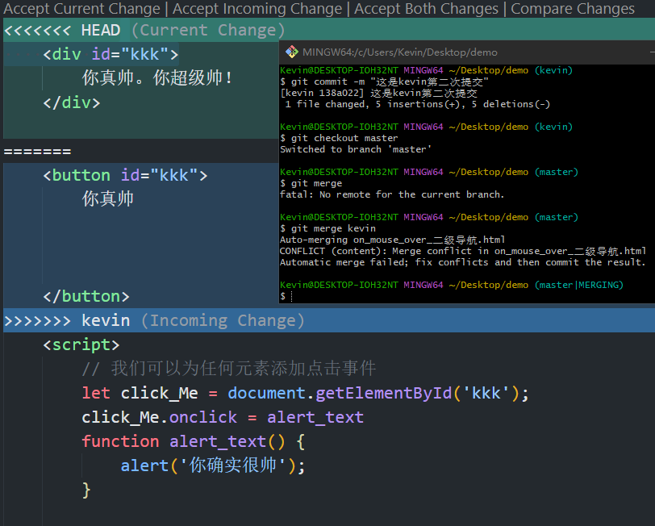

## 解决git合并分支冲突




当合并分支冲突后VSCode智能提示、然后点击Accept Current Change或其他选项手动解决冲突、再次输入`git add .` 命令即可提交

> 需要注意的是新增代码是可以成功合并的、对现有代码产生修改、合并才会产生冲突

## 基本概念

- 工作区：就是你在电脑里能看到的目录。
- 暂存区：英文叫 stage 或 index。一般存放在 **.git** 目录下的 index 文件（.git/index）中，所以我们把暂存区有时也叫作索引（index）。
- 版本库：工作区有一个隐藏目录 **.git**，这个不算工作区，而是 Git 的版本库。

## GIT基本操作

### 配置用户信息

```shell
git config --global user.name "Kevin"
git config --global user.email "cat20201314@163.com"
```

### 检查配置信息

```shell
# 查看所有的全局配置项
git config --list --global
```

### 以精简的方式显示文件状态

```shell
# 以精简的方式显示文件状态
git status -s
git status --short
```

### 跟踪新文件

```shell
git add index.html
# 如果文件过多，你项跟踪目录下所有文件
git add .
```

### 提交更新

```shell
git commit -m "Frist commit"
```


### 取消暂存的文件

把文件移除暂存区

```shell
git reset HEAD 要移出的文件名称
```

### 跳过暂存区域

要在提交的时候，给 `git commit` 加上 `-a` 选项，Git 就会自动把所有已经跟踪过的文件暂存起来一并提交，从而跳过 `git add` 步骤

```shell
git commit -a -m "日志信息"
```

### 移除文件

```shell
# 从 Git仓库和工作区中同时移除 index.js 文件
git rm -f index.js
# 只从 Git 仓库中移除 index.css，但保留工作区中的 index.css 文件
git rm --cached index.css
```

### `.gitignore` 的格式规范

1.  以 **# 开头**的是注释
2.  以 **/ 结尾**的是目录
3.  以 **/ 开头**防止递归
4.  以 **! 开头**表示取反
5.  可以使用 **glob 模式**进行文件和文件夹的匹配（glob 指简化了的正则表达式）
    - **星号 \*** 匹配**零个或多个任意字符**
    - **`[abc]`** 匹配**任何一个列在方括号中的字符** （此案例匹配一个 a 或匹配一个 b 或匹配一个 c） 
    - **问号 ?** 只匹配**一个任意字符**
    - **两个星号 \**** 表示匹配**任意中间目录**（比如 a/**/z 可以匹配 a/z 、 a/b/z 或 a/b/c/z 等）
    - 在方括号中使用**短划线**分隔两个字符， 表示所有在这两个字符范围内的都可以匹配（比如 [0-9] 表示匹配所有 0 到 9 的数字）

### 查看提交历史

```shell
# 按时间先后顺序列出所有的提交历史，最近的提交在最上面
git log

# 只展示最新的两条提交历史，数字可以按需进行填写
git log -2

# 在一行上展示最近两条提交历史的信息
git log -2 --pretty=oneline

# 在一行上展示最近两条提交历史信息，并自定义输出的格式
# %h 提交的简写哈希值  %an 作者名字  %ar 作者修订日志  %s 提交说明
git log -2 --pretty=format:"%h | %an | %ar | %s"
```

`常用的`

```shell
git log --pretty=oneline
```

### 「 回退到指定的版本」

```shell
# 使用 git reset --hard 命令，根据指定的提交 ID 回退到指定版本
git reset --hard <CommitID>
```

### 如果回退到历史版本，如何查看所有历史记录

```shell
# 在旧版本中使用 git reflog --pretty=oneline 命令，查看命令操作的历史
git reflog --pretty=onelone
```

### 生成SSH key

1. 打开 Git Bash

2. 执行如下命令

   ssh-keygen -t rsa -b 4096 -C "cat20201314@163.com" 

```
ssh-keygen -m PEM -t ed25519 -C "cat20201314@163.com" 
```

### [参考地址](https://help.coding.net/docs/repo/ssh/config.html)

1. 连续输入 3 次回车，即会在 `C:\Users\用户名文件夹\.ssh` 目录下生成 SSH key


### SSH key由哪两部分组成

- id_rsa（私钥文件，存放于客户端的电脑中即可）

- id_rsa.pub（公钥文件，**需要配置到 Github 中**）

### 检查SSH key是否配置成功

```shell
ssh -T git@github.com  # GitHub
ssh -T git@gitee.com   # 码云
ssh -T git@coding.net  #coding
```

## 基于SSH将本地仓库推送到GitHub

####  推送步骤

1、关联本地仓库和远程仓库，将关联到的远程仓库命令为origin

```shell
git remote add origin 远程仓库SSH地址
```

2、将当前所在主分支master重命名为main分支（非必须）

*由于最近爆发的美国的黑人事件，master有奴隶主的意思，GitHub为了避嫌，因此在文档中会建议用户把master分支重命名为main分支*

```shell
git branch -M main
```

3、将本地分支推送到远程仓库

```shell
# 如果没有执行第2步
git push -u origin master

# 如果执行了第2步
git push -u origin main
```

## [Git 分支管理](https://www.runoob.com/git/git-branch.html)

1. 什么是主分支？

   在初始化本地 Git 仓库的时候，Git默认已经帮我们创建了一个名字叫做 `master`的分支。通常我们把这个`master`分支叫做主分支。

2. 使用主分支有什么注意事项？

   按照约定，在团队开发中，不要直接在主分支上改代码。

3. 主分支和其他分支有本质区别吗？

   没有本质区别，所有分支的特性都是一样的, `master`也只是分支的名字而已。

```shell
# 创建分支命令
git branch (branchname)
# 示例
git branch testing

# 查看本地分支
git branch
# 查看所有分支
git branch -a

# 切换分支命令
git checkout (branchname)
# 创建新分支并立即切换到该分支下
git checkout -b (branchname) 

# 合并分支命令
git merge 
# 删除分支命令
git branch -d (branchname)
```

## git push 完整命令

```shell
git push <远程主机名> :<本地分支名>
```

```shell
git push <远程主机名>
# 如果当前分支和远程分支存在追踪关系，则本地分支和远程分支都可以忽略。

git push
# 如果当前分支只有一个远程分支，那么远程主机也可以省略，可以使用
```

```shell
git push -u
# 如果当前分支和多个主机之间存在追踪关系，可以使用这个命令来设置一个默认的主机，例如：
git push -u origin master
```

```shell
git push –force <远程主机> #强制提交
git push -f #简写
# git push -f 这个命令的作用是将自己本地仓库的代码直接推送至仓库，完全以你的提交为准，之前其他人的提交都会被覆盖。
```

## git pull 

> 拉取最新代码至本地

## git branch

```sh
# 删除分支命令
git branch -d (branchname)

# 强制删除
git branch -D reg (branchname)

# 删除远程分支
git push origin --delete (branchname)
```

## 连接多个远程仓库