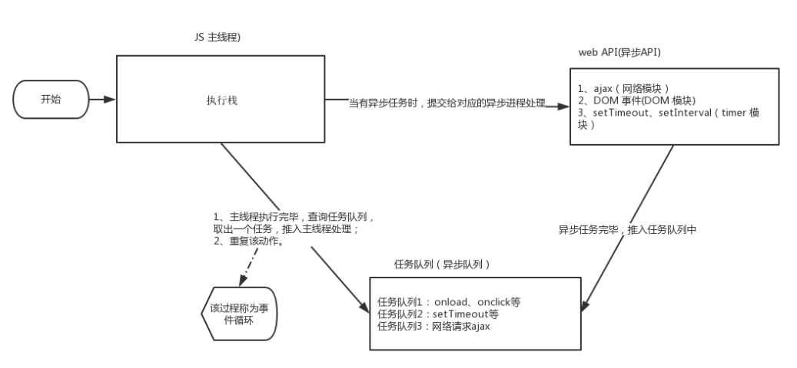

# JS执行机制

### [参考文献](https://developer.mozilla.org/zh-CN/docs/Web/JavaScript/EventLoop)

JavaScript 语言的一大特点就是**单线程**，也就是说，**同一个时间只能做一件事**。

这是因为 Javascript 这门脚本语言诞生的使命所致——JavaScript 是为处理页面中用户的交互，以及操作 DOM 而诞生的。比如我们对某个 DOM 元素进行添加和删除操作，不能同时进行。 应该先进行添加，之后 再删除。

单线程就意味着，所有任务需要排队，前一个任务结束，才会执行后一个任务。这样所导致的问题是： 如 果 JS 执行的时间过长，这样就会造成页面的渲染不连贯，导致页面渲染加载阻塞的感觉。

为了解决这个问题，利用多核 CPU 的计算能力，**HTML5 提出 Web Worker 标准**，允许 JavaScript 脚本创建多个线 程。于是，JS 中出现了**同步和异步**。

### 同步

前一个任务结束后再执行后一个任务，程序的执行顺序与任务的排列顺序是一致的、同步的。比如做饭的同步 做法：我们要烧水煮饭，等水开了（10分钟之后），再去切菜，炒菜。

### 异步

你在做一件事情时，因为这件事情会花费很长时间，在做这件事的同时，你还可以去处理其他事 情。比如做饭的异步做法，我们在烧水的同时，利用这10分钟，去切菜，炒菜。

> 他们的本质区别： 这条流水线上各个流程的执行顺序不同。

### 同步任务

同步任务都在主线程上执行，形成一个**执行栈**。

### 异步任务

JS 的异步是通过回调函数实现的。

一般而言，异步任务有以下三种类型:

1. 普通事件，如 click、resize 等
2. 资源加载，如 load、error 等
3. 定时器，包括 setInterval、setTimeout 等

异步任务相关添加到任务队列中（任务队列也称为消息队列）。

1. 先执行**执行栈**中的同步任务。
2. 异步任务放入任务队列中。
3. 一旦执行栈中的所有同步任务执行完毕，系统就会按次序读取任务队列中的异步任务，于是被读取的异步任务结束等待状 态，进入执行栈，开始执行



# 并发模型与事件循环

JavaScript 有一个基于**事件循环**的并发模型，事件循环负责执行代码、收集和处理事件以及执行队列中的子任务。这个模型与其它语言中的模型截然不同，比如 C 和 Java。

### 运行时概念

接下来的内容解释了这个理论模型。现代 JavaScript 引擎实现并着重优化了以下描述的这些语义

### 可视化描述


### 栈

函数调用形成了一个由若干帧组成的栈。

```js
function foo(b) {
  let a = 10;
  return a + b + 11;
}

function bar(x) {
  let y = 3;
  return foo(x * y);
}

console.log(bar(7)); // 返回 42
```

当调用 `bar` 时，第一个帧被创建并压入栈中，帧中包含了 `bar` 的参数和局部变量。 当 `bar` 调用 `foo` 时，第二个帧被创建并被压入栈中，放在第一个帧之上，帧中包含 `foo` 的参数和局部变量。当 `foo` 执行完毕然后返回时，第二个帧就被弹出栈（剩下 `bar` 函数的调用帧 ）。当 `bar` 也执行完毕然后返回时，第一个帧也被弹出，栈就被清空了。

### 堆

对象被分配在堆中，堆是一个用来表示一大块（通常是非结构化的）内存区域的计算机术语。

### 队列

一个 JavaScript 运行时包含了一个待处理消息的消息队列。每一个消息都关联着一个用以处理这个消息的回调函数。

在 [事件循环](https://developer.mozilla.org/zh-CN/docs/Web/JavaScript/EventLoop#事件循环) 期间的某个时刻，运行时会从最先进入队列的消息开始处理队列中的消息。被处理的消息会被移出队列，并作为输入参数来调用与之关联的函数。正如前面所提到的，调用一个函数总是会为其创造一个新的栈帧。

函数的处理会一直进行到执行栈再次为空为止；然后事件循环将会处理队列中的下一个消息（如果还有的话）。

## 事件循环

之所以称之为 **事件循环**，是因为它经常按照类似如下的方式来被实现：

```js
while (queue.waitForMessage()) {
  queue.processNextMessage();
}
```

`queue.waitForMessage()` 会同步地等待消息到达 (如果当前没有任何消息等待被处理)。

### [执行至完成](https://developer.mozilla.org/zh-CN/docs/Web/JavaScript/EventLoop#执行至完成)

每一个消息完整地执行后，其它消息才会被执行。这为程序的分析提供了一些优秀的特性，包括：当一个函数执行时，它不会被抢占，只有在它运行完毕之后才会去运行任何其他的代码，才能修改这个函数操作的数据。这与 C 语言不同，例如，如果函数在线程中运行，它可能在任何位置被终止，然后在另一个线程中运行其他代码。

这个模型的一个缺点在于当一个消息需要太长时间才能处理完毕时，Web 应用程序就无法处理与用户的交互，例如点击或滚动。为了缓解这个问题，浏览器一般会弹出一个“这个脚本运行时间过长”的对话框。一个良好的习惯是缩短单个消息处理时间，并在可能的情况下将一个消息裁剪成多个消息。

### [添加消息](https://developer.mozilla.org/zh-CN/docs/Web/JavaScript/EventLoop#添加消息)

在浏览器里，每当一个事件发生并且有一个事件监听器绑定在该事件上时，一个消息就会被添加进消息队列。如果没有事件监听器，这个事件将会丢失。所以当一个带有点击事件处理器的元素被点击时，就会像其他事件一样产生一个类似的消息。

函数 `setTimeout` 接受两个参数：待加入队列的消息和一个时间值（可选，默认为 0）。这个时间值代表了消息被实际加入到队列的最小延迟时间。如果队列中没有其它消息并且栈为空，在这段延迟时间过去之后，消息会被马上处理。但是，如果有其它消息，`setTimeout` 消息必须等待其它消息处理完。因此第二个参数仅仅表示最少延迟时间，而非确切的等待时间。

下面的例子演示了这个概念（`setTimeout` 并不会在计时器到期之后直接执行）：

```js
const s = new Date().getSeconds();

setTimeout(function() {
  // 输出 "2"，表示回调函数并没有在 500 毫秒之后立即执行
  console.log("Ran after " + (new Date().getSeconds() - s) + " seconds");
}, 500);

while(true) {
  if(new Date().getSeconds() - s >= 2) {
    console.log("Good, looped for 2 seconds");
    break;
  }
}
```

### [零延迟](https://developer.mozilla.org/zh-CN/docs/Web/JavaScript/EventLoop#零延迟)

零延迟并不意味着回调会立即执行。以 0 为第二参数调用 `setTimeout` 并不表示在 0 毫秒后就立即调用回调函数。

其等待的时间取决于队列里待处理的消息数量。在下面的例子中，`"这是一条消息"` 将会在回调获得处理之前输出到控制台，这是因为延迟参数是运行时处理请求所需的最小等待时间，但并不保证是准确的等待时间。

基本上，`setTimeout` 需要等待当前队列中所有的消息都处理完毕之后才能执行，即使已经超出了由第二参数所指定的时间。

```js
(function() {

  console.log('这是开始');

  setTimeout(function cb() {
    console.log('这是来自第一个回调的消息');
  });

  console.log('这是一条消息');

  setTimeout(function cb1() {
    console.log('这是来自第二个回调的消息');
  }, 0);

  console.log('这是结束');

})();

// "这是开始"
// "这是一条消息"
// "这是结束"
// "这是来自第一个回调的消息"
// "这是来自第二个回调的消息"
```

### [多个运行时互相通信](https://developer.mozilla.org/zh-CN/docs/Web/JavaScript/EventLoop#多个运行时互相通信)

一个 web worker 或者一个跨域的 `iframe` 都有自己的栈、堆和消息队列。两个不同的运行时只能通过 [`postMessage`](https://developer.mozilla.org/zh-CN/docs/Web/API/Window/postMessage) 方法进行通信。如果另一个运行时侦听 `message` 事件，则此方法会向该运行时添加消息。

## [永不阻塞](https://developer.mozilla.org/zh-CN/docs/Web/JavaScript/EventLoop#永不阻塞)

JavaScript 的事件循环模型与许多其他语言不同的一个非常有趣的特性是，它永不阻塞。 处理 I/O 通常通过事件和回调来执行，所以当一个应用正等待一个 [IndexedDB](https://developer.mozilla.org/zh-CN/docs/Web/API/IndexedDB_API) 查询返回或者一个 [XHR](https://developer.mozilla.org/zh-CN/docs/Web/API/XMLHttpRequest) 请求返回时，它仍然可以处理其它事情，比如用户输入。

由于历史原因有一些例外，如 `alert` 或者同步 XHR，但应该尽量避免使用它们。注意，[例外的例外也是存在的](https://stackoverflow.com/questions/2734025/is-javascript-guaranteed-to-be-single-threaded/2734311#2734311)（但通常是实现错误而非其它原因）。