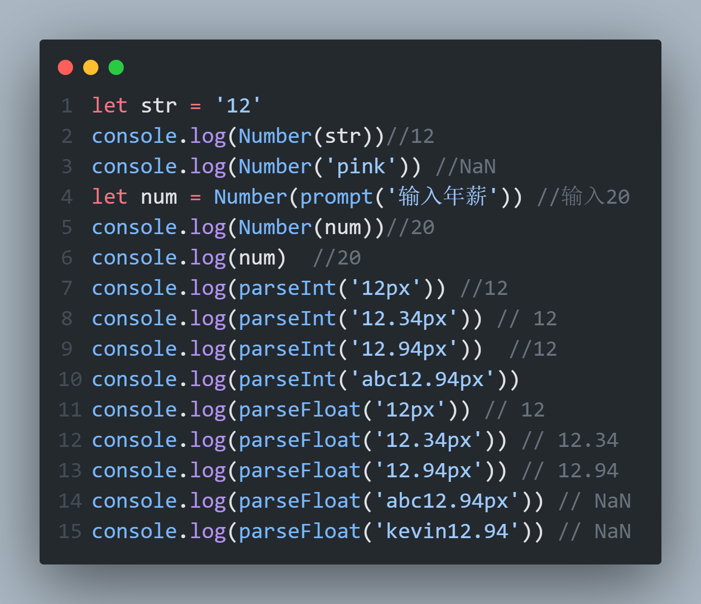

# JavaScript显式转换

## 转换为数字型

### Number(数据)

> 1. 转成数字型
> 2. 如果字符串内容里有非数字,转换失败时结果为NaN(Not a Number)即不是一个数字
> 3. NaN也是number类型的数据,代表非数字

### parseInt(数据)

> 只保留整数

### parseFloat(数据)

> 可以保留小数



```javascript
let str = '12'
console.log(Number(str))//12
console.log(Number('pink')) //NaN
let num = Number(prompt('输入年薪')) //输入20
console.log(Number(num))//20
console.log(num)  //20
console.log(parseInt('12px')) //12
console.log(parseInt('12.34px')) // 12
console.log(parseInt('12.94px'))  //12
console.log(parseInt('abc12.94px')) 
console.log(parseFloat('12px')) // 12
console.log(parseFloat('12.34px')) // 12.34
console.log(parseFloat('12.94px')) // 12.94
console.log(parseFloat('abc12.94px')) // NaN
console.log(parseFloat('kevin12.94')) // NaN
```

## 转换为字符型

### String(数据)

### 变量.toString(进制)

