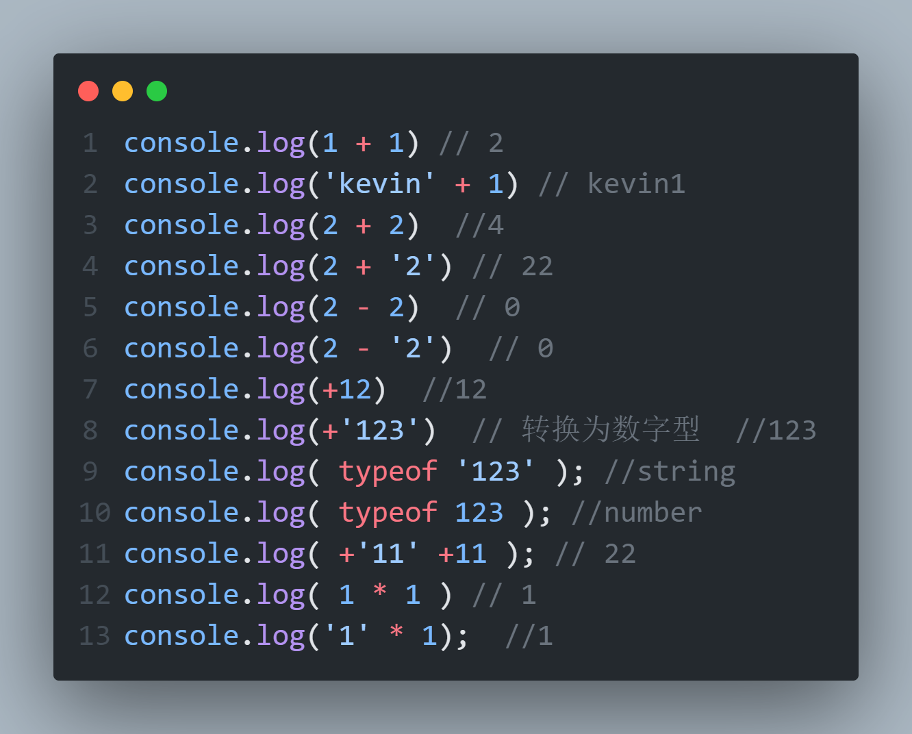

# JavaScript隐式转换

## 规则

1. +号两边只要有一个是字符串,都会把另外一个转成字符串
2. 除了+以外的算数运算符 比如  `-`  `*`  `/`  等都会把数据转成数字类型

## 小技巧

1. `+`号作为正号解析可以转换成数字型
2. 任何数据和字符串相加结果都是字符串




```javascript
console.log(1 + 1) // 2
console.log('kevin' + 1) // kevin1
console.log(2 + 2)  //4
console.log(2 + '2') // 22
console.log(2 - 2)  // 0
console.log(2 - '2')  // 0  
console.log(+12)  //12 
console.log(+'123')  // 转换为数字型  //123
console.log( typeof '123' ); //string
console.log( typeof 123 ); //number 
console.log( +'11' +11 ); // 22
console.log( 1 * 1 ) // 1
console.log('1' * 1);  //1

```

