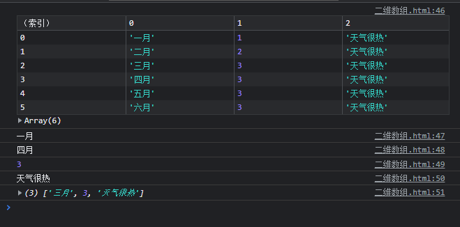
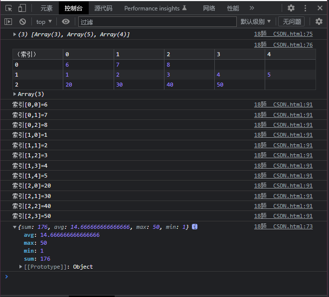
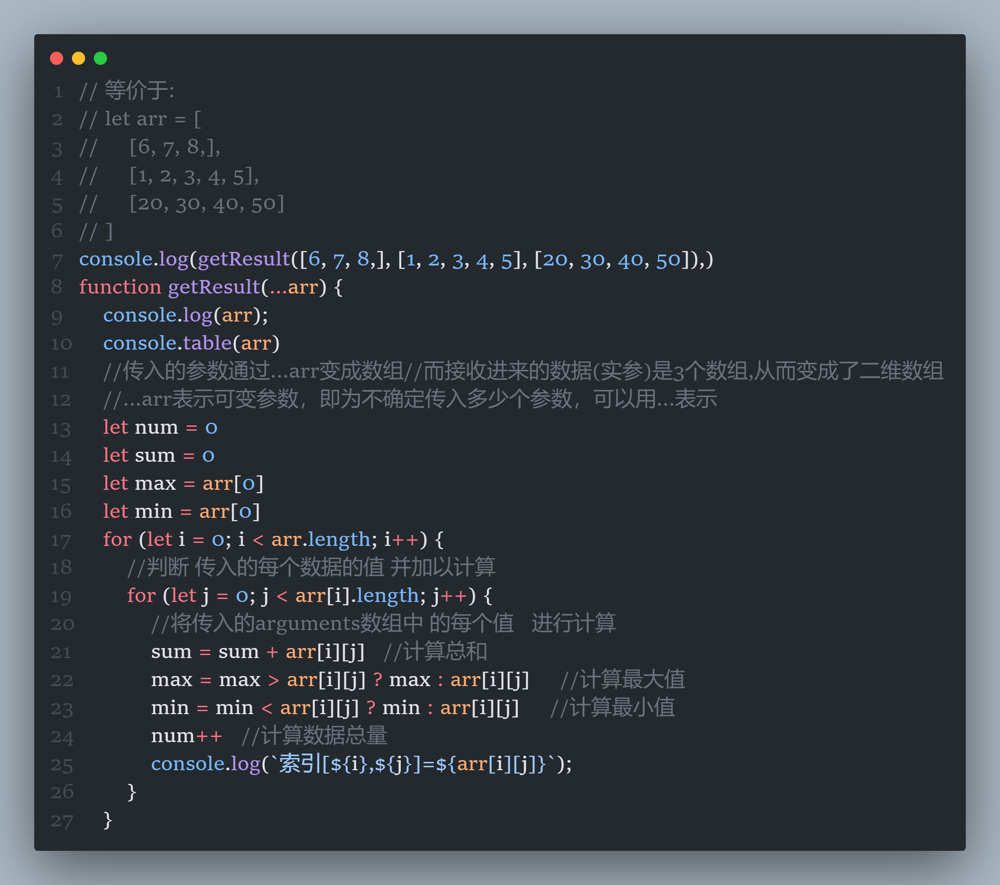

# 二维数组

JavaScript 本身不提供多维数组，但是，可以通过定义元素数组来创建多维数组，其中每个元素也是另一个数组，出于这个原因，可以说 JavaScript 多维数组是数组的数组，即**嵌套数组**。定义多维数组的最简单方法是使用数组字面量表示法。

要在控制台中显示这个二维数组，可以使用`console.table()` 方法清晰的展示其二维数组：

要访问多维数组的元素，首先使用方括号访问返回内部数组的外部数组元素；然后使用另一个方括号访问内部数组的元素。如下：

```js
const months = [
    ['一月', 1, '天气很热'],
    ['二月', 2, '天气很热'],
    ['三月', 3, '天气很热'],
    ['四月', 3, '天气很热'],
    ['五月', 3, '天气很热'],
    ['六月', 3, '天气很热'],
]
console.table(months)
console.log(months[0][0]);
console.log(months[3][0]);
console.log(months[3][1]);
console.log(months[3][2]);
console.log(months[3, 2]);
```



要创建一个空的二维数组，可以使用 `Array.from` 和 `Array` 构造函数。

## 迭代多维数组

要迭代多维数组，需要使用嵌套的 `for` 循环，如下例所示：

```javascript
        // 等价于:  
        // let arr = [
        //     [6, 7, 8,],
        //     [1, 2, 3, 4, 5],
        //     [20, 30, 40, 50]
        // ]
        console.log(getResult([6, 7, 8,], [1, 2, 3, 4, 5], [20, 30, 40, 50]),)
        function getResult(...arr) {
            console.log(arr);
            console.table(arr)
            //传入的参数通过...arr变成数组//而接收进来的数据(实参)是3个数组,从而变成了二维数组
            //...arr表示可变参数，即为不确定传入多少个参数，可以用...表示
            let num = 0
            let sum = 0
            let max = arr[0]
            let min = arr[0]
            for (let i = 0; i < arr.length; i++) {
                //判断 传入的每个数据的值 并加以计算
                for (let j = 0; j < arr[i].length; j++) {
                    //将传入的arguments数组中 的每个值   进行计算
                    sum = sum + arr[i][j]   //计算总和
                    max = max > arr[i][j] ? max : arr[i][j]     //计算最大值
                    min = min < arr[i][j] ? min : arr[i][j]     //计算最小值
                    num++   //计算数据总量
                    console.log(`索引[${i},${j}]=${arr[i][j]}`);
                }
            }
            // console.log(`传入一个数组,数组长度是${num}`)
            let avg = sum / num     //计算平均值
            let result = {
                sum: sum,
                avg: avg,
                max: max,
                min: min
            }
            return result
        }
```






