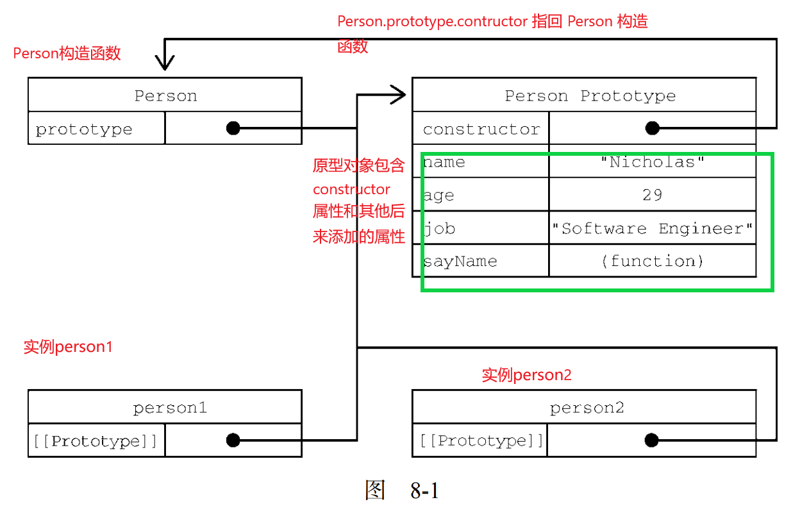
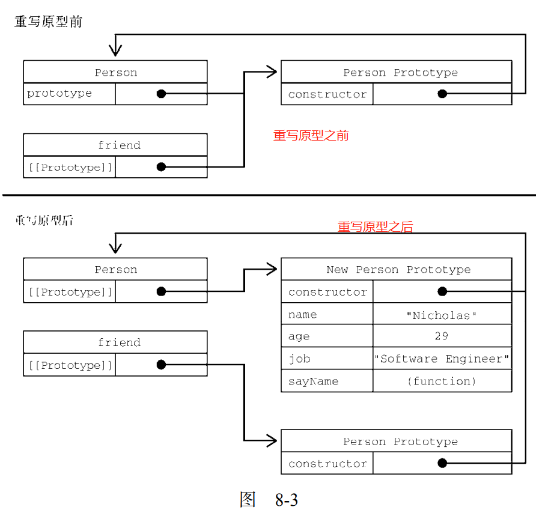

# 构造函数

## this指向

***构造函数和原型对象中的this 都指向 实例化的对象***

## 构造函数

比如我们创建了佩奇的对象，继续创建乔治的对象还需要重新写一 遍，此时可以通过构造函数来快速创建多个类似的对象。

***构造函数是来快速创建多个类似的对象***

```js

// let Peppa = {
//     name: '佩奇',
//     age:6,
//     gender:'女'
// }
// let Georga = {
//     name: '乔治',
//     age:3,
//     gender:'男'
// }
// let Mun = {
//     name: '猪妈妈',
//     age:30,
//     gender:'女'
// }
// let Dad = {
//     name: '猪爸爸',
//     age:32,
//     gender:'男'
// }
function Pig(name,age,gender){
    this.name = name
    this.age = age
    this.gender = gender
}
// 创建佩奇对象
let Peppa = new Pig('佩奇',6,'女')
// 创建佩奇对象
let Georga = new Pig('乔治',6,'女')
// 创建佩奇对象
let Mun = new Pig('猪妈妈',6,'女')
// 创建佩奇对象
let Dad = new Pig('猪爸爸',6,'女')
document.write(Dad.name);//猪爸爸
```

- **没有显示地创建对象**
- **属性和方法直接赋值给了this**
- **没有return**

按照惯例，构造函数名称的首字母都是要大写的， 非构造函数则以小写字母开头。并且只能由 "new" 操作符来执行。这是从面向对象编程语言那里借鉴的，有助于在 ECMAScript 中区分构 造函数和普通函数。***毕竟 ECMAScript 的构造函数就是能创建对象的函数。***

> ***毕竟 ECMAScript 的构造函数就是能创建对象的函数。***

要创建 Pig 的实例，应使用 new 操作符。以这种方式调用构造函数会执行如下操作。

1. 在内存中创建一个新对象。
2. **这个新对象内部的[[Prototype]]特性被赋值为构造函数的 prototype 属性。**
3.  **构造函数内部的 this 被赋值为这个新对象（即 this 指向新对象）**
4. **执行构造函数内部的代码（给新对象添加属性）**
5.  如果构造函数返回非空对象，则返回该对象；否则，返回刚创建的新对象。

构造函数不一定要写成函数声明的形式。赋值给变量的**函数表达式**也可以表示构造函数：

```js
let Person = function(name, age, job) { //函数表达式
 this.name = name; 
 this.age = age; 
 this.job = job; 
 this.sayName = function() { 
 console.log(this.name); 
 }; 
} 
let person1 = new Person("Nicholas", 29, "Software Engineer"); 
let person2 = new Person("Greg", 27, "Doctor"); 
person1.sayName(); // Nicholas 
person2.sayName(); // Greg 
console.log(person1 instanceof Object); // true 
console.log(person1 instanceof Person); // true 
console.log(person2 instanceof Object); // true 
console.log(person2 instanceof Person); // true 
```

## 构造函数也是函数

***构造函数与普通函数唯一的区别就是调用方式不同***。除此之外，构造函数也是函数。并没有把某个 函数定义为构造函数的特殊语法。**任何函数只要使用 new 操作符调用就是构造函数**，**而不使用 new 操 作符调用的函数就是普通函数**。比如，前面的例子中定义的 Person()可以像下面这样调用：

```js
// 作为构造函数 
let person = new Person("Nicholas", 29, "Software Engineer"); 
person.sayName(); // "Nicholas" 
// 作为函数调用
Person("Greg", 27, "Doctor"); // 添加到 window 对象
window.sayName(); // "Greg" 
// 在另一个对象的作用域中调用
let o = new Object(); 
Person.call(o, "Kristen", 25, "Nurse"); 
o.sayName(); // "Kristen" 
```

这个例子一开始展示了典型的构造函数调用方式，即使用 new 操作符创建一个新对象。然后是普通 函数的调用方式，这时候**没有使用 new 操作符调用 Person()，结果会将属性和方法添加到 window 对 象**。这里要记住，在调用一个函数而没有明确设置 this 值的情况下（即没有作为对象的方法调用，或 者没有使用 call()/apply()调用），this 始终指向 Global 对象（在浏览器中就是 window 对象）。 因此在上面的调用之后，window 对象上就有了一个 sayName()方法，调用它会返回"Greg"。最后展 示的调用方式是通过 call()（或 apply()）调用函数，同时将特定对象指定为作用域。这里的调用将 对象 o 指定为 Person()内部的 this 值，因此执行完函数代码后，所有属性和 sayName()方法都会添 加到对象 o 上面。

## 构造函数的问题浪费内存

构造函数虽然有用，但也不是没有问题。构造函数的主要问题在于，其定义的方法会在每个实例上 都创建一遍。因此对前面的例子而言，person1 和 person2 都有名为 sayName()的方法，但这两个方 法不是同一个 Function 实例。我们知道，ECMAScript 中的函数是对象，因此每次定义函数时，都会 初始化一个对象。逻辑上讲，这个构造函数实际上是这样的:

```js
function Person(name, age, job){ 
 this.name = name; 
 this.age = age; 
 this.job = job; 
 this.sayName = new Function("console.log(this.name)"); // 逻辑等价
} 
```

这样理解这个构造函数可以更清楚地知道，每个 Person 实例都会有自己的 Function 实例用于显 示 name 属性。当然了，以这种方式创建函数会带来不同的作用域链和标识符解析。但创建新 Function 实例的机制是一样的。因此不同实例上的函数虽然同名却不相等，如下所示：

```js
console.log(person1.sayName == person2.sayName); // false 
```

因为都是做一样的事，所以没必要定义两个不同的 Function 实例。况且，this 对象可以把函数 与对象的绑定推迟到运行时。 要解决这个问题，可以把函数定义转移到构造函数外部：

```js
function Person(name, age, job){ 
 this.name = name; 
 this.age = age; 
 this.job = job; 
 this.sayName = sayName; 
} 
function sayName() { 
 console.log(this.name); 
} 
let person1 = new Person("Nicholas", 29, "Software Engineer"); 
let person2 = new Person("Greg", 27, "Doctor"); 
person1.sayName(); // Nicholas 
person2.sayName(); // Greg
```

在这里，sayName()被定义在了构造函数外部。在构造函数内部，sayName 属性等于全局 sayName() 函数。因为这一次 sayName 属性中包含的只是一个指向外部函数的指针，所以 person1 和 person2 共享了定义在全局作用域上的 sayName()函数。这样虽然解决了相同逻辑的函数重复定义的问题，但 全局作用域也因此被搞乱了，因为那个函数实际上只能在一个对象上调用。如果这个对象需要多个方法， 那么就要在全局作用域中定义多个函数。这会导致自定义类型引用的代码不能很好地聚集一起。这个新 问题可以通过原型模式来解决。

## 原型模式

***每个函数都会创建一个 prototype 属性，这个属性是一个对象***，`包含应该由特定引用类型的实例 共享的属性和方法`。***实际上，这个对象就是通过调用构造函数创建的对象的原型***。使用原型对象的好处 是，在它上面定义的属性和方法可以被对象实例共享。原来在构造函数中直接赋给对象实例的值，可以 直接赋值给它们的原型，如下所示：

```js
function Person() {} 
Person.prototype.name = "Nicholas"; 
Person.prototype.age = 29; 
Person.prototype.job = "Software Engineer"; 
Person.prototype.sayName = function() { 
 console.log(this.name); 
}; 
let person1 = new Person(); 
person1.sayName(); // "Nicholas" 
let person2 = new Person(); 
person2.sayName(); // "Nicholas" 
console.log(person1.sayName == person2.sayName); // true
```

使用函数表达式也可以:

```js
let Person = function() {}; 
Person.prototype.name = "Nicholas"; 
Person.prototype.age = 29; 
Person.prototype.job = "Software Engineer"; 
Person.prototype.sayName = function() { 
 console.log(this.name); 
}; 
let person1 = new Person(); 
person1.sayName(); // "Nicholas" 
let person2 = new Person(); 
person2.sayName(); // "Nicholas" 
console.log(person1.sayName == person2.sayName); // true 
```

***这里，所有属性和 sayName()方法都直接添加到了 Person 的 prototype 属性上***，构造函数体中 什么也没有。但这样定义之后，调用构造函数创建的新对象仍然拥有相应的属性和方法。与构造函数模 式不同，***使用这种原型模式定义的属性和方法是由所有实例共享的。因此 person1 和 person2 访问的 都是相同的属性和相同的 sayName()函数。***要理解这个过程，就必须理解 ECMAScript 中原型的*本质*。

## 原型

1. 构造函数通过原型分配的函数是所有对象所 共享的。
2. JavaScript 规定，***每一个构造函数都有一个 prototype 属性***，指向另一个对象，所以我们也称为原型对象
3. 这个对象可以挂载函数，对象实例化不会多次创建原型上函数，节约内存
4. ***我们可以把那些不变的方法，直接定义在 prototype 对象上，这样所有对象的实例就可以共享这些方法。***
5. ***构造函数和原型对象中的this 都指向 实例化的对象***

## 理解原型

无论何时，**只要创建一个函数，就会按照特定的规则为这个函数创建一个 prototype 属性（*指向 原型对象*）**。*默认情况下，所有原型对象自动获得一个名为 constructor 的属性*，`指回与之关联的构造函数`。对前面的例子而言，Person.prototype.constructor 指向 Person。然后，因构造函数而 异，可能会给原型对象添加其他属性和方法。

在自定义构造函数时，原型对象默认只会获得 constructor 属性，其他的所有方法都继承自 Object。每次调用构造函数创建一个新实例，**这个实例的内部`[[Prototype]]`指针就会被赋值为构 造函数的原型对象**。脚本中没有访问这个`[[Prototype]]`特性的标准方式，但 Firefox、Safari 和 Chrome 会在每个对象上暴露`__proto__`属性，通过这个属性可以访问对象的原型。在其他实现中，这个特性 完全被隐藏了。关键在于理解这一点：实例与构造函数原型之间有直接的联系，但实例与构造函数之 间没有。

```js
console.log(Person.prototype.constructor);
// Person.prototype.constructor 指向与之关联的构造函数
//输出 ƒ Person() {}
```

## 图解原型对象



图 8-1 展示了 Person 构造函数、Person 的原型对象和 Person 现有两个实例之间的关系

Person.prototype 指向原型对象，而 Person.prototype.contructor 指回 Person 构造函数。原 型对象包含 constructor 属性和其他后来添加的属性。Person 的两个实例 person1 和 person2 都只 有一个内部属性指回 Person.prototype，而且两者都与构造函数没有直接联系。另外要注意，虽然这两 个实例都没有属性和方法，但 person1.sayName()可以正常调用。这是由于对象属性查找机制的原因。

虽然不是所有实例都对外暴露了[[Prototype]]，但可以使用 isPrototypeOf()方法确定两个对 象之间的这种关系。本质上，isPrototypeOf()会在传入参数的[[Prototype]]指向调用它的对象时 返回 true，如下所示：

```js
console.log(Person.prototype.isPrototypeOf(person1)); // true 
console.log(Person.prototype.isPrototypeOf(person2)); // true
```

这里通过原型对象调用 isPrototypeOf()方法检查了 person1 和 person2。因为这两个例子内 部都有链接指向 Person.prototype，所以结果都返回 true。

ECMAScript 的 Object 类型有一个方法叫 `Object.getPrototypeOf()`，返回参数的内部特性 `[[Prototype]]`的值。例如：

```js
console.log(Object.getPrototypeOf(person1) == Person.prototype); // true 
console.log(Object.getPrototypeOf(person1).name); // "Nicholas" 
```

使用 `Object.getPrototypeOf()`可以 方便地取得一个对象的原型，而这在通过原型实现继承时显得尤为重要（本章后面会介绍）。

Object 类型还有一个 `setPrototypeOf()`方法，可以向实例的私有特性[[Prototype]]写入一 个新值。这样就可以重写一个对象的原型继承关系：

> Object.setPrototypeOf()可能会严重影响代码性能。Mozilla 文档说得很清楚： “在所有浏览器和 JavaScript 引擎中，修改继承关系的影响都是微妙且深远的。这种影响并 不仅是执行 Object.setPrototypeOf()语句那么简单，而是会涉及所有访问了那些修 改过[[Prototype]]的对象的代码。”

为避免使用 Object.setPrototypeOf()可能造成的性能下降，可以通过 `Object.create()`来创 建一个新对象，同时为其指定原型

## 原型层级

在通过对象访问属性时，会按照这个属性的名称开始搜索。搜索开始于对象实例本身。如果在这个 实例上发现了给定的名称，则返回该名称对应的值。如果没有找到这个属性，则搜索会沿着指针进入原 型对象，然后在原型对象上找到属性后，再返回对应的值。因此，在调用 person1.sayName()时，会 发生两步搜索。首先，JavaScript 引擎会问：“person1 实例有 sayName 属性吗？”答案是没有。然后， 继续搜索并问：“person1 的原型有 sayName 属性吗？”答案是有。于是就返回了保存在原型上的这 个函数。在调用 person2.sayName()时，会发生同样的搜索过程，而且也会返回相同的结果。这就是 原型用于在多个对象实例间共享属性和方法的原理

> 前面提到的 constructor 属性只存在于原型对象，因此通过实例对象也是可以访 问到的。

虽然可以通过实例读取原型对象上的值，但不可能通过实例重写这些值。如果在实例上添加了一个 与原型对象中同名的属性，那就会在实例上创建这个属性，这个属性会遮住原型对象上的属性。下面看 一个例子：

```js
function Person() {} 
Person.prototype.name = "Nicholas"; 
Person.prototype.age = 29; 
Person.prototype.job = "Software Engineer"; 
Person.prototype.sayName = function() { 
 console.log(this.name); 
}; 
let person1 = new Person(); 
let person2 = new Person(); 
person1.name = "Greg"; 
console.log(person1.name); // "Greg"，来自实例
console.log(person2.name); // "Nicholas"，来自原型
```

在这个例子中，person1 的 name 属性遮蔽了原型对象上的同名属性。虽然 person1.name 和 person2.name 都返回了值，但前者返回的是"Greg"（来自实例），后者返回的是"Nicholas"（来自 原型）。当 console.log()访问 person1.name 时，会先在实例上搜索个属性。因为这个属性在实例 上存在，所以就不会再搜索原型对象了。而在访问 person2.name 时，并没有在实例上找到这个属性， 所以会继续搜索原型对象并使用定义在原型上的属性

只要给对象实例添加一个属性，这个属性就会遮蔽（shadow）原型对象上的同名属性，也就是虽然 不会修改它，但会屏蔽对它的访问。即使在实例上把这个属性设置为 null，也不会恢复它和原型的联 系。不过，使用 delete 操作符可以完全删除实例上的这个属性，从而让标识符解析过程能够继续搜索 原型对象。

```js
function Person() {} 
Person.prototype.name = "Nicholas"; 
Person.prototype.age = 29; 
Person.prototype.job = "Software Engineer"; 
Person.prototype.sayName = function() { 
 console.log(this.name); 
}; 
let person1 = new Person(); 
let person2 = new Person(); 
person1.name = "Greg"; 
console.log(person1.name); // "Greg"，来自实例
console.log(person2.name); // "Nicholas"，来自原型
delete person1.name; 
console.log(person1.name); // "Nicholas"，来自原型
```

这个修改后的例子中使用 delete 删除了 person1.name，这个属性之前以"Greg"遮蔽了原型上 的同名属性。然后原型上 name 属性的联系就恢复了，因此再访问 person1.name 时，就会返回原型对 象上这个属性的值

### hasOwnProperty()

hasOwnProperty()方法***用于确定某个属性是在实例上还是在原型对象上***。这个方法是继承自 Object 的，会在属性存在于调用它的对象实例上时返回 true，如下面的例子所示：

```js
function Person() {} 
Person.prototype.name = "Nicholas"; 
Person.prototype.age = 29; 
Person.prototype.job = "Software Engineer"; 
Person.prototype.sayName = function() { 
 console.log(this.name); 
}; 
let person1 = new Person(); 
let person2 = new Person(); 
console.log(person1.hasOwnProperty("name")); // false 
person1.name = "Greg"; 
console.log(person1.name); // "Greg"，来自实例
console.log(person1.hasOwnProperty("name")); // true 
console.log(person2.name); // "Nicholas"，来自原型
console.log(person2.hasOwnProperty("name")); // false 
delete person1.name; 
console.log(person1.name); // "Nicholas"，来自原型
console.log(person1.hasOwnProperty("name")); // false 
```

在这个例子中，通过调用 hasOwnProperty()能够清楚地看到访问的是实例属性还是原型属性。 调用 person1.hasOwnProperty("name")只在重写 person1 上 name 属性的情况下才返回 true，表 明此时 name 是一个实例属性，不是原型属性。图 8-2 形象地展示了上面例子中各个步骤的状态。（为简 单起见，图中省略了 Person 构造函数。

### 原型和 in 操作符


## 对象迭代

ECMAScript 2017 新增了两 个静态方法，用于将对象内容转换为序列化的——更重要的是可迭代的——格式。这两个静态方法 `Object.values()`和 `Object.entries()`***接收一个对象，返回它们内容的数组***。`Object.values()` ***返回对象值的数组***，`Object.entries()`***返回键/值对的数组***

```js
const o = { 
 foo: 'bar', 
 baz: 1, 
 qux: {} 
}; 
console.log(Object.values(o)); 
// ["bar", 1, {}] 
console.log(Object.entries((o))); 
// [["foo", "bar"], ["baz", 1], ["qux", {}]]
```

> 注意，非字符串属性会被转换为字符串输出。另外，这两个方法执行对象的浅复制

## 原型语法简写

在前面的例子中，每次定义一个属性或方法都会把 Person.prototype 重 写一遍。为了减少代码冗余，也为了从视觉上更好地封装原型功能，直接通过一个包含所有属性和方法 的对象字面量来重写原型成为了一种常见的做法，如下面的例子所示：

```js
function Person() {} 
Person.prototype = {
 name: "Nicholas", 
 age: 29, 
 job: "Software Engineer", 
 sayName() { 
 console.log(this.name); 
 } 
}; 
console.log(Person.prototype.constructor);
// Object() { [native code] }
// Person.prototype 的 constructor 属性就不指向 Person了
```

在这个例子中，Person.prototype 被设置为等于一个通过对象字面量创建的新对象。最终结果 是一样的，只有一个问题：***这样重写之后，Person.prototype 的 constructor 属性就不指向 Person 了***。在创建函数时，也会创建它的 prototype 对象，同时会自动给这个原型的 constructor 属性赋 值。而上面的写法完全重写了默认的 prototype 对象，***因此其 constructor 属性也指向了完全不同 的新对象（Object 构造函数），不再指向原来的构造函数。***虽然 instanceof 操作符还能可靠地返回 值，但我们不能再依靠 constructor 属性来识别类型了，如下面的例子所示：

```js
let friend = new Person(); 
console.log(friend instanceof Object); // true 
console.log(friend instanceof Person); // true
console.log(friend.constructor == Person); // false 
console.log(friend.constructor == Object); // true
```

这里，instanceof仍然对Object和Person都返回true。但constructor属性现在等于Object 而不是 Person 了。如果 constructor 的值很重要，则可以像下面这样在重写原型对象时专门设置一 下它的值：

```js
function Person() { 
} 
Person.prototype = { 
 constructor: Person, 
 name: "Nicholas", 
 age: 29, 
 job: "Software Engineer", 
 sayName() { 
 console.log(this.name); 
 } 
}; 

```

这次的代码中特意包含了 constructor 属性，并将它设置为 Person，保证了这个属性仍然包含 恰当的值。 但要注意，以这种方式恢复 constructor 属性会创建一个[[Enumerable]]为 true 的属性。而 原生 constructor 属性默认是不可枚举的。因此，如果你使用的是兼容 ECMAScript 的 JavaScript 引擎， 那可能会改为使用 Object.defineProperty()方法来定义 constructor 属性：

```js
function Person() {} 
Person.prototype = { 
    name: "Nicholas", 
    age: 29, 
    job: "Software Engineer", 
    sayName() { 
    console.log(this.name); 
    } 
}; 
// 恢复 constructor 属性
Object.defineProperty(Person.prototype, "constructor", { 
    enumerable: false, 
    value: Person 
}); 
console.log(Person.prototype.constructor); //ƒ Person() {}
```

## 原型的动态性

因为从原型上搜索值的过程是动态的，所以即使实例在修改原型之前已经存在，任何时候对原型对 象所做的修改也会在实例上反映出来。下面是一个例子：

```js
let friend = new Person(); 
Person.prototype.sayHi = function() { 
    console.log("hi"); 
}; 
friend.sayHi(); // "hi"，没问题！
```

以上代码先创建一个 Person 实例并保存在 friend 中。然后一条语句在 Person.prototype 上 添加了一个名为 sayHi()的方法。***虽然 friend 实例是在添加方法之前创建的，但它仍然可以访问这个方法***。之所以会这样，***主要原因是实例与原型之间松散的联系***。在调用 friend.sayHi()时，**首先会从 这个实例中搜索名为 sayHi 的属性。在没有找到的情况下，运行时会继续搜索原型对象。因为实例和 原型之间的链接就是简单的指针，而不是保存的副本，所以会在原型上找到 sayHi 属性并返回这个属 性保存的函数**。

虽然随时能给原型添加属性和方法，并能够立即反映在所有对象实例上，但这跟重写整个原型是两 回事。实例的[[Prototype]]指针是在调用构造函数时自动赋值的，这个指针即使把原型修改为不同 的对象也不会变。***重写整个原型会切断最初原型与构造函数的联系，但实例引用的仍然是最初的原型***。 记住，`实例只有指向原型的指针，没有指向构造函数的指针`。来看下面的例子:

```js
function Person() {} 
let friend = new Person(); 
// 实例化构造函数 在重写原型对象之前创建,会导致报错
Person.prototype = {//重写原型对象
    constructor: Person, 
    name: "Nicholas", 
    age: 29, 
    job: "Software Engineer", 
    sayName() { 
    console.log(this.name); 
    } 
}; 
friend.sayName(); // 错误
```

在这个例子中，Person 的新实例是在重写原型对象之前创建的。在调用 friend.sayName()的时 候，会导致错误。这是因为 firend 指向的原型还是最初的原型，而这个原型上并没有 sayName 属性。 图 8-3 展示了这里面的原因。



***重写构造函数上的原型之后再创建的实例才会引用新的原型。而在此之前创建的实例仍然会引用最 初的原型。***

##  原生对象原型

原型模式之所以重要，不仅体现在自定义类型上，而且还因为它也是实现所有原生引用类型的模式。 所有原生引用类型的构造函数（包括 Object、Array、String 等）都在原型上定义了实例方法。比如， 数组实例的 sort()方法就是 Array.prototype 上定义的，而字符串包装对象的 substring()方法也 是在 String.prototype 上定义的

通过原生对象的原型可以取得所有默认方法的引用，也可以给原生类型的实例定义新的方法。可以 像修改自定义对象原型一样修改原生对象原型，因此随时可以添加方法。比如，下面的代码就给 String 原始值包装类型的实例添加了一个 startsWith()方法：

```js
String.prototype.startsWith = function (text) { 
 return this.indexOf(text) === 0; 
}; 
let msg = "Hello world!"; 
console.log(msg.startsWith("Hello")); // true
```

如果给定字符串的开头出现了调用 startsWith()方法的文本，那么该方法会返回 true。因为这 个方法是被定义在 String.prototype 上，所以当前环境下所有的字符串都可以使用这个方法。msg 是个字符串，在读取它的属性时，后台会自动创建 String 的包装实例，从而找到并调用 startsWith() 方法

> **注意**
>
> 尽管可以这么做，但并不推荐在产品环境中修改原生对象原型。这样做很可能造成 误会，而且可能引发命名冲突（比如一个名称在某个浏览器实现中不存在，在另一个实现 中却存在）。另外还有可能意外重写原生的方法。***推荐的做法是创建一个自定义的类，继 承原生类型。***

## 原型的问题

***原型模式也不是没有问题。首先，它弱化了向构造函数传递初始化参数的能力，会导致所有实例默 认都取得相同的属性值。虽然这会带来不便，但还不是原型的最大问题。原型的最主要问题源自它的共 享特性。***

我们知道，原型上的所有属性是在实例间共享的，这对函数来说比较合适。另外包含原始值的属性 也还好，如前面例子中所示，可以通过在实例上添加同名属性来简单地遮蔽原型上的属性。***真正的问题 来自包含引用值的属性。来看下面的例子：***

```js
function Person() { }
Person.prototype = {
  constructor: Person,
  name: "Nicholas",
  age: 29,
  job: "Software Engineer",
  friends: ["Shelby", "Court"],
  sayName() {
    console.log(this.name);
  }
};
let person1 = new Person();
let person2 = new Person();
person1.friends.push("Van");
console.log(person1.friends); // "Shelby,Court,Van" 
console.log(person2.friends); // "Shelby,Court,Van" 
console.log(person1.friends === person2.friends); // true
```

这里，Person.prototype 有一个名为 friends 的属性，它包含一个字符串数组。然后这里创建 了两个 Person 的实例。person1.friends 通过 push 方法向数组中添加了一个字符串。***由于这个 friends 属性存在于 Person.prototype 而非 person1 上，新加的这个字符串也会在（指向同一个 数组的）person2.friends 上反映出来。如果这是有意在多个实例间共享数组，那没什么问题。但一 般来说，不同的实例应该有属于自己的属性副本。这就是实际开发中通常不单独使用原型模式的原因。***

## 继承

继承是面向对象编程中讨论最多的话题。很多面向对象语言都支持两种继承：***接口继承和实现继承***。 *前者只继承方法签名，后者继承实际的方法*。接口继承在 ECMAScript 中是不可能的，因为函数没有签 名。实现继承是 ECMAScript 唯一支持的继承方式，而这主要是通过原型链实现的。

### instanceof

`instanceof` 运算符用来检测 `constructor.prototype `是否存在于参数 `object` 的原型链上。

```js
object instanceof constructor
//object 某个实例对象
//constructor 某个构造函数
```


### 原型链

ECMA-262 把原型链定义为 ECMAScript 的主要继承方式。其基本思想就是通过原型继承多个引用 类型的属性和方法。*重温一下构造函数、原型和实例的关系：每个构造函数都有一个原型对象，原型有 一个`constructor`属性指回构造函数，而实例有一个内部指针指向原型。如果原型是另一个类型的实例呢？那就意味 着这个原型本身有一个内部指针指向另一个原型，相应地另一个原型也有一个指针指向另一个构造函 数*。这样就***在实例和原型之间构造了一条原型链***。这就是原型链的基本构想

盗用构造函数

组合继承

原型式继承

寄生式继承

寄生式组合继承

## 类

### 类定义

类（class）是 ECMAScript 中新的基础性语法糖结构，因此刚开始接触时可能会不太习惯。虽然 ECMAScript 6 类表面 上看起来可以支持正式的面向对象编程，***但实际上它背后使用的仍然是原型和构造函数的概念***。

类声明

```js
class Person {}
```

类表达式

```js
const Animal = class {}
```

函数受函数作用域限制，而***类受块作用域限制***

### 类构造函数

constructor 关键字用于在类定义块内部创建类的构造函数。方法名 constructor 会告诉解释器 在使用 new 操作符创建类的新实例时，应该调用这个函数。构造函数的定义不是必需的，不定义构造函 数相当于将构造函数定义为空函数。

实例化

使用 new 操作符实例化 Person 的操作等于使用 new 调用其构造函数。唯一可感知的不同之处就 是，JavaScript 解释器知道使用 new 和类意味着应该使用 constructor 函数进行实例化。

使用 new 调用类的构造函数会执行如下操作。

1. 在内存中创建一个新对象
2. 这个新对象内部的[[Prototype]]指针被赋值为构造函数的 prototype 属性。
3. 构造函数内部的 this 被赋值为这个新对象（即 this 指向新对象）
4. 执行构造函数内部的代码（给新对象添加属性）
5. 如果构造函数返回非空对象，则返回该对象；否则，返回刚创建的新对象

类构造函数与构造函数的主要区别是，调用类构造函数必须使用 new 操作符。而普通构造函数如果 不使用 new 调用，那么就会以全局的 this（通常是 window）作为内部对象。调用类构造函数时如果 忘了使用 new 则会抛出错误：

```js
function Person() {}
class Animal {}
// 把 window 作为 this 来构建实例
let p = Person();
let a = Animal();
// TypeError: class constructor Animal cannot be invoked without 'new'
```

### 把类当成特殊函数

ECMAScript 中没有正式的类这个类型。从各方面来看，ECMAScript 类就是一种特殊函数。声明一 个类之后，通过 typeof 操作符检测类标识符，表明它是一个函数：

```js
class Person {}
console.log(Person); // class Person {}
console.log(typeof Person); // function
```

类标识符有 prototype 属性，而这个原型也有一个 constructor 属性指向类自身：

```js
class Person{}
console.log(Person.prototype); // { constructor: f() }
console.log(Person === Person.prototype.constructor); // true 

```

与普通构造函数一样，可以使用 instanceof 操作符检查构造函数原型是否存在于实例的原型链中：

```js
class Person {} 
let p = new Person(); 
console.log(p instanceof Person); // true 
```

***在类的上下文中，类本身在使用 new 调用时就 会被当成构造函数。重点在于，类中定义的 constructor 方法不会被当成构造函数***

**在对它使用 instanceof 操作符时会返回 false。但是，如果在创建实例时直接将类构造函数当成普通构造函数来 使用，那么 instanceof 操作符的返回值会反转：**

```js
class Person {} 
let p1 = new Person(); 
console.log(p1.constructor === Person); // true 
console.log(p1 instanceof Person); // true 
console.log(p1 instanceof Person.constructor); // false 
let p2 = new Person.constructor(); 
console.log(p2.constructor === Person); // false 
console.log(p2 instanceof Person); // false 
console.log(p2 instanceof Person.constructor); // true 
```

### 一等公民的类

类是 JavaScript 的一等公民，因此可以像其他对象或函数引用一样**把类作为参数传递**：

## 继承extends

前面花了大量篇幅讨论如何使用 ES5 的机制实现继承。ECMAScript 6 新增特性中最出色的一 个就是原生支持了类继承机制。虽然类继承使用的是新语法，但背后依旧使用的是原型链。

ES6 类支持单继承。使用 `extends` 关键字，就可以继承任何拥有[[Construct]]和原型的对象。 很大程度上，这意味着不仅可以继承一个类，也可以继承普通的构造函数（保持向后兼容）


## 实例化构造函数

```js
//1~创建构造函数
function Pig(name,age,gender){
    this.name = name
    this.age = age
    this.gender = gender
}
//2~new关键字调用函数
//new Pig('猪爸爸',6,'女')
//接受创建的对象
let Dad = new Pig('猪爸爸',6,'女')
document.write(Dad.name);//猪爸爸
```

说明:

1. 使用new关键字调用函数的行为被称为***实例化***
2. ***实例化构造函数***没有参数时可以省略()
3. 构造函数内部无需写return,返回值即为新创建的对象
4. 构造函数内部的return返回的值无效,所以不要写return
5.  ***new Object（） new Date（） 也是实例化构造函数***

## 实例化执行过程

1. ***创建新对象***
2. ***构造函数this指向新对象***
3. 执行构造函数代码,修改this,添加新的属性
4. 返回新对象

### 实例成员

***通过构造函数创建的对象称为实例对象***，*实例对象中的属性和方法称为实例成员。*

说明:

1. ***实例对象的属性和方法即为实例成员***
2. 为构造函数传入参数,动态创建**结构相同**但**值不同**的对象
3. 构造函数创建的**实例对象彼此独立**互不影响

### 静态成员

***构造函数的属性和方法被称为静态成员***

说明:

1. 构造函数的属性和方法被称为静态成员
2. 一般公共特征的属性或方法静态成员设置为静态成员
3. 静态成员方法中的 this 指向构造函数本身

## 内置构造函数

1. Object 
2. Array 
3. String 
4. Number

### Object

Object 是内置的构造函数，用于创建普通对象。

推荐使用字面量方式声明对象，而不是 Object 构造函数

```js
let user = new Object({
    name: '猪爸爸',
    age:32,
    gender:'男'
})
console.table(user)
```

三个常用静态方法（静态方法就是只有构造函数Object可以调用的）

1. `Object.keys` 静态方法获取对象中所有属性（键).返回的是一个数组
2. `Object.values` 静态方法获取对象中所有属性值.返回的是一个数组
3. `Object. assign` 静态方法常用于对象拷贝

```js
const o = {
  uname: 'pink',
  age: 18
}
// 1.获得所有的属性名
console.log(Object.keys(o))  //返回数组['uname', 'age']
// 2. 获得所有的属性值
console.log(Object.values(o))  //  ['pink', 18]
// 3. 对象的拷贝
const obj = {}
Object.assign(obj, o)
console.log(obj)//{uname: 'pink', age: 18}
Object.assign(o, { gender: '女' })
console.log(o)//{uname: 'pink', age: 18, gender: '女'}
```

