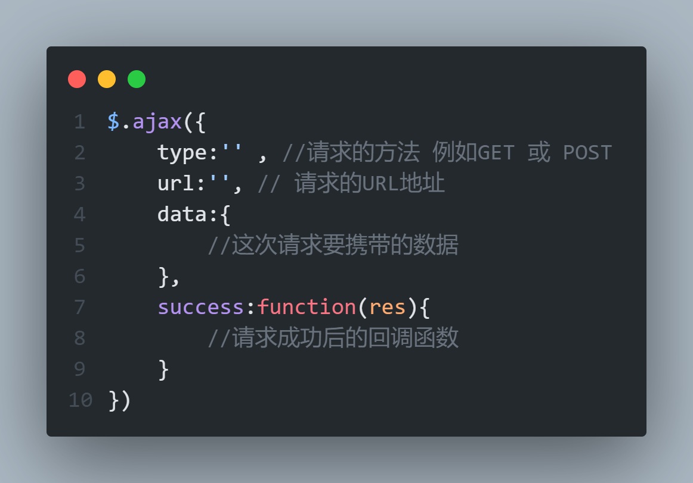
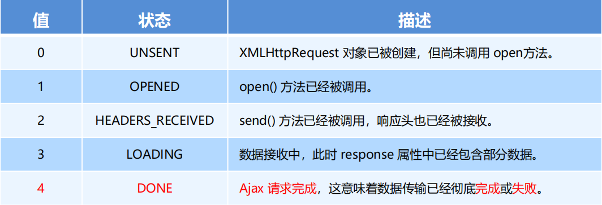
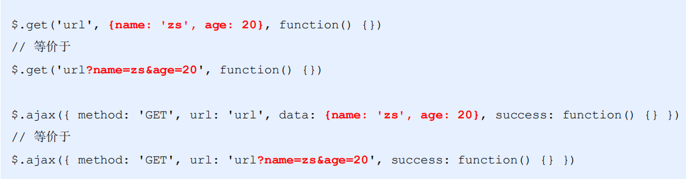

# Ajax

## 服务器概念

### 服务器

存放和对外提供资源的电脑 ,叫服务器,

本质上 ,就是一台电脑,只不过,它的性能比个人电脑高得多

### 客户端

负责获取和消费资源的电脑,叫做客户端

## url地址

全称是 `UniformResourceLocator` 中文叫 `统一资源定位符`

用于标识互联网每个资源的唯一存放位置.浏览器只有通过URL地址，才能正确定位资源的存放位置，从而成功访问到对应的资源

### url地址组成部分

1. 客户端与服务器之间的`通信协议`
2. 存有该资源的`服务器名称`
3. 资源在服务器上的`具体的存放位置`


### 客户端与服务器的通信过程

客户端

1. 打开浏览器
2. 输入要访问的地址
3. 回车,向服务器发起资源**请求**

服务器

1. 服务器接收到客户端发来的资源请求
2. 服务器在内部处理这次请求 找到相关的资源
3. 服务器把找到的资源 **响应(发送)**给客户端

> 分为 请求  -  处理  -  响应 三个步骤

### 网页如何请求数据

需要用`XMLHttpRequest`对象

`XMLHttpRequest`简称(xhr)是浏览器提供的js成员  ,可以请求服务器上的数据资源

最简单的用法

```js
var xhrObj = new XMLHttpRequest()
```

### 资源的请求方式

请求方式有很多种,最常见的有 `get`  和 `post` 请求 

- get 请求用于获取服务器资源(向服务器要资源)
- post 用于向服务器提交数据(往服务器发送资源). 比如 提交的登录信息   注册信息   用户信息 等


## Ajax

### Ajax概念

Ajax 的全称是 Asynchronous JavaScript And XML（异步 JavaScript 和 xml）

**在网页中利用 `XMLHttpRequest` 对象和服务器进行数据交互的方式，就是Ajax**


### jQuery中的Ajax

浏览器中提供的 XMLHttpRequest 用法比较复杂 所以 jQuery 对 XMLHttpRequest 进行了封装  提供了一系列的 Ajax的相关的函数 极大降低了 Ajax的 使用难度

常用方法

1. $.get()
2. $.post()
3. $.ajax()

### $.get()函数语法

接受三个参数

```
$.get(url , [data] , [callback])
```

|  参数名  | 参数类型 | 是否必选 |             说明             |
| :------: | :------: | :------: | :--------------------------: |
|   url    |  string  |  **是**  |     要请求的**资源地址**     |
|   data   |  object  |    否    | 请求资源期间要**携带的参数** |
| callback | function |    否    |   请求成功时的**回调函数**   |


> 可以发起不带参数的请求即 没有 data  参数


### $.post()函数语法

$.post函数功能单一 专门用来发起post请求,从而向服务器提交数据

```
$.post(url , [data] , [callback])
```

|  参数名  | 参数类型 | 是否必选 |             说明             |
| :------: | :------: | :------: | :--------------------------: |
|   url    |  string  |  **是**  |      **请求数据的地址**      |
|   data   |  object  |    否    |       **要提交的数据**       |
| callback | function |    否    | 数据提交成功时的**回调函数** |


### $.ajax()函数语法

相比于 `$.get()` 和 `$.post()` 函数，`jQuery` 中提供的 `$.ajax()` 函数，是一个功能比较综合的函数，它允许我们对 `Ajax` 请求进行更详细的配置




```js
$.ajax({
    type:'' , //请求的方法 例如GET 或 POST
    url:'', // 请求的URL地址
    data:{
        //这次请求要携带的数据
    },
    success:function(res){
        //请求成功后的回调函数
    }
})
```

### 发起 GET 请求

只需要将 `type` 属性 的值设置为 ‘`GET`’ 即可

如果省略type属性，默认发送的就是GET请求

###  发起 POST 请求

只需要把 `type`属性的值 设置为POST即可

### 接口概念


使用 Ajax 请求数据时，被请求的 URL 地址，就叫做 数据接口（简称**接口**）

### 接口文档

接口文档，顾名思义就是 **接口的说明文档**，**它是我们调用接口的依据**。好的接口文档包含了对 **接口URL**，**参数** 以及 **输出内容** 的说明，我们参照接口文档就能方便的知道接口的作用，以及接口如何进行调用

### 接口文档的组成部分

1. **接口名称**：用来标识各个接口的简单说明，如 **登录接口**，**获取图书列表接口**等
2. **接口URL**：接口的调用地址
3. **调用方式**：接口的调用方式，如 **GET** 或者 **POST**
4. **参数格式**：接口需要传递的参数，每个参数必须包含 **参数名称**、**参数类型**、**是否必选**、**参数说明** 这4项内容
5. **响应格式**：接口的返回值的详细描述，一般包含**数据名称**、**数据类型**、**说明**3项内容
6. **返回示例（可选）**：通过对象的形式，列举服务器返回数据的结构

## XMLHttpRequest

XMLHttpRequest（简称 **xhr**），是浏览器提供的 Javascript 对象

### xhr发起GET请求

1. 创建 `xhr` 对象

   ```js
   var xhr = new XMLHttpRequest()
   ```

2. 调用 `xhr.open()` 函数

   ```js
   xhr.open('GET', 'http://www.liulongbin.top:3006/api/getbooks')
   ```

3. 调用 `xhr.send()` 函数

   ```js
   xhr.send()
   ```

4. 监听 `xhr.onreadystatechange` 事件

   ```js
   xhr.onreadystatechange = function () {
     if (xhr.readyState === 4 && xhr.status === 200) {
        // 获取服务器响应的数据
        console.log(xhr.responseText)
      }
   }
   ```

### xhr发起POST请求

- 创建 `xhr` 对象

  ```js
  var xhr = new XMLHttpRequest()
  ```

- 调用 `xhr.open()` 函数

  ```js
  xhr.open('POST', 'http://www.liulongbin.top:3006/api/addbook')
  ```

- **设置 Content-Type 属性**（固定写法）

  ```js
  xhr.setRequestHeader('Content-Type', 'application/x-www-form-urlencoded')
  ```

- 调用 `xhr.send()` 函数，**同时指定要发送的数据**

  ```js
  xhr.send('bookname=水浒传&author=施耐庵&publisher=上海图书出版社')
  ```

- 监听 `xhr.onreadystatechange` 事件

  ```js
  xhr.onreadystatechange = function () {
    if (xhr.readyState === 4 && xhr.status === 200) {
      console.log(xhr.responseText)
    }
  }
  ```


### xhr对象的`readyState`属性



### xhr发起带参数的GET请求

在调用 `xhr.open()` 设置请求`URL`的时候，**携带get参数**即可


> **补充说明**：
>
> 这种在 `URL` 地址后面拼接的参数，叫做**查询字符串**。


### 查询字符串

查询字符串（URL 参数）是指在 URL 的末尾加上用于向服务器发送信息的字符串（变量）

将英文的 **?** 放在`URL` 的末尾，然后再加上 **参数＝值** ，想加上多个参数的话，使用 **&** 符号进行分隔。以这个形式，可以将想要发送给服务器的数据添加到 `URL` 中。


### GET请求携带参数的本质

无论使用 `$.ajax()`，还是使用 `$.get()`，又或者直接使用 xhr 对象发起 GET 请求，当需要携带参数的时候，本质上，都是直接将参数以查询字符串的形式，追加到 URL 地址的后面，发送到服务器的。



### URL编码

URL编码是一种浏览器用来打包表单输入的格式，通俗来说：而格式中，只允许出现英文相关的字母、标点符号、数字

如果 URL 中需要包含中文这样的字符，则必须对中文字符进行**编码**（转义）。

URL编码的原则:

- 使用安全的字符（没有特殊用途或者特殊意义的可打印字符）去表示那些不安全的字符。
- URL编码原则的**通俗**理解：使用英文字符去表示非英文字符

### URL编码与解码

### 编码

调用浏览器提供的 `encodeURI()` 编码的函数

### 解码

调用浏览器提供的`decodeURI()` 解码的函数

如果获取的数据是通过了 `encodeURI` 进行编码的，就需要通过 `decodeURI` 进行解码

> **由于浏览器会自动对 URL 地址进行编码操作，因此，大多数情况下，程序员不需要关心 URL 地址的编码**
>
> 更多关于 URL 编码的知识，请参考如下博客：
>
> https://blog.csdn.net/Lxd_0111/article/details/78028889

### 数据交换格式

**服务器端**与**客户端**之间进行**数据传输与交换的格式**

前端领域，经常提及的两种数据交换格式分别是 XML 和 JSON。其中 XML 用的非常少，所以，我们重点要学习的数据交换格式就是 JSON

### XML

`XML` 的英文全称是 **EXtensible Markup Language**，即**可扩展标记语言**。因此，XML 和 `HTML` 类似，也是一种标记语言。

XML 被设计用来**传输和存储数据**，是数据的载体

> 缺点:
>
> - XML 格式臃肿，和数据无关的代码多，体积大，传输效率低
> - 在 Javascript 中解析 XML 比较麻烦

## JSON

JSON 的英文全称是 **JavaScript Object Notation**，即“**JavaScript 对象表示法**”。

简单来讲，JSON 就是 Javascript 对象和数组的字符串表示法，它使用文本表示一个 JS 对象或数组的信息，因此，**JSON 的本质是字符串**。

### JSON的的两种结构

### 对象结构

1. 对象结构在 JSON 中表示为 `{ }` 括起来的内容。数据结构为 `{ key: value, key: value, … }` 的键值对结构
2. `key` 必须是使用英文的`双引号`包裹的字符串，value 的数据类型可以是**数字、字符串、布尔值、null、数组、对象**6种类型。

> 字符串也必须是双引号

### 数组结构

1. 数组结构在 JSON 中表示为 `[ ]` 括起来的内容。数据结构为 `[ "java", "javascript", 30, true … ]` 。
2. 数组中数据的类型可以是**数字、字符串、布尔值、null、数组、对象**6种类型。

### JSON语法注意事项

1. 属性名必须使用双引号包裹
2. 字符串类型的值必须使用双引号包裹
3. JSON 中不允许使用单引号表示字符串
4. JSON 中不能写注释
5. JSON 的最外层必须是对象或数组格式
6. 不能使用 `undefined` 或函数作为 JSON 的值

### JSON和JS对象的关系

1. JSON 是 JS 对象的字符串表示法
2. 它使用文本表示一个 JS 对象的信息，本质是一个字符串

### JSON和JS对象的互转

要实现从 JSON 字符串转换为 JS 对象，使用 `JSON.parse()` 方法：

要实现从 JS 对象转换为 JSON 字符串，使用 `JSON.stringify()` 方法：

###  应用场景 -xhr请求

```js
var xhr = new XMLHttpRequest()
xhr.open('GET', 'http://www.liulongbin.top:3006/api/getbooks')
xhr.send()
xhr.onreadystatechange = function () {
  if (xhr.readyState === 4 && xhr.status === 200) {
    console.log(xhr.responseText)
    console.log(typeof xhr.responseText)
    var result = JSON.parse(xhr.responseText)
    console.log(result)
  }
}
```

### 序列化和反序列化

1. 把**数据对象** **转换为** **字符串**的过程，叫做**序列化**，例如：调用 `JSON.stringify()` 函数的操作，叫做 `JSON` 序列化。
2. 把**字符串** **转换为** **数据对象**的过程，叫做**反序列化**，例如：调用 `JSON.parse()` 函数的操作，叫做 `JSON` 反序列化。

## axios

1. Axios 是专注于**网络数据请求**的库
2. 相比于原生的 XMLHttpRequest 对象，axios **简单易用**。相比于 jQuery，axios 更加**轻量化**，只专注于网络数据请求

###  axios发起GET请求

```js
axios.get('url', { params: { /*参数*/ } }).then(callback)
```


```js
// 请求的 URL 地址
var url = 'http://www.liulongbin.top:3006/api/get'
// 请求的参数对象
var paramsObj = { name: 'zs', age: 20 }
// 调用 axios.get() 发起 GET 请求
axios.get(url, { params: paramsObj }).then(function(res) {
     // res.data 是服务器返回的数据
     var result = res.data
     console.log(res)
})
```

### axios发起POST请求

```javascript
axios.post('url', { /*参数*/ }).then(callback)
```

```javascript
// 请求的 URL 地址
var url = 'http://www.liulongbin.top:3006/api/post'
// 要提交到服务器的数据
var dataObj = { location: '北京', address: '顺义' }
// 调用 axios.post() 发起 POST 请求
axios.post(url, dataObj).then(function(res) {
     // res.data 是服务器返回的数据
     var result = res.data
     console.log(result)
})
```

### axios发起请求

```javascript
axios({
 method: '请求类型',
 url: '请求的URL地址',
 data: { /* POST数据 */ },
 params: { /* GET参数 */ }
}).then(callback)
```

发起get请求

```javascript
document.querySelector('#btn3').addEventListener('click', function () {
      var url = 'http://www.liulongbin.top:3006/api/get'
      var paramsData = { name: '钢铁侠', age: 35 }
      axios({
        method: 'GET',
        url: url,
        params: paramsData
      }).then(function (res) {
        console.log(res.data)
      })
})
```

#### 发起post请求

```javascript
document.querySelector('#btn4').addEventListener('click', function () {
  axios({
    method: 'POST',
    url: 'http://www.liulongbin.top:3006/api/post',
    data: {
      name: '娃哈哈',
      age: 18,
      gender: '女'
    }
  }).then(function (res) {
    console.log(res.data)
  })
})
```

### axios.create进行二次封装

```js
const instance = axios.create({
   baseURL:"http://localhost:3000"
})

// 使用instance发请求
instance({
    url:"/posts"
})

// 或
instance.get("/posts")

```

#### 同时请求 多个端口号

```js
const instance = axios.create({
    baseURL:"http://localhost:3000"
})

const instance2 = axios.create({
    baseURL:"http://localhost:4000"
})

// 同时请求 端口号 3000 4000

// 使用instance发请求
instance({
    url:"/posts"
})

// 使用instance2发请求
instance2({
    url:"/posts"
})

```


## HTTP

[菜鸟HTTP教程](https://www.runoob.com/http/http-tutorial.html)

超文本传输协议（Hyper Text Transfer Protocol，HTTP）


### 404

404状态码（404 Not Found），指所请求的页面不存在、已被删除或无法访问。

404状态码是一种http状态码，其意思是： 所请求的页面不存在或已被删除。通俗的讲就是当用户输入了错误的链接时，返回的页面。


## async/await

async/await 是ES8  引入的新语法,  用来简化 Promise异步操作 在async/await 出现之前 开发者只能通过链式.then()的方式处理Promise 异步操作  

### async/await基本使用

**使用async修饰函数也就是说要把async添加在函数的前面**

```js
async function fn(){

}

const fn = async ()=>{

}
```

在 Promise 对象前面添加await，可以直接得到Promise的结果，无需then,如下：

```js
async function fn(){
    var p = new Promise((resolve,reject)=>{ resolve('result')  })
    // await 后面的内容应该是一个Promise对象，await的作用就是用来简化Promise对象的使用
    // 当我们在Promise对象前面添加await关键字之后，Promise对象就无需编写.then.catch的处理函数了，直接将Promise的结果作为赋值给res
    // await 这个单词的意思就是等待的意思，Promise一般代表是异步任务，await就会等到异步任务有结果之后，得到结果并进行赋值
    const res = await p;
}

fn()
```

### async/await的使用注意事项

> await所在的function必须被async修饰
>
> 在async方法中，第一个await之前的代码会被同步执行，await之后的代码会异步执行


## Form表单

表单由几部分构成？分别是什么？

1. 表单域： ``
2. 表单标签：包含了文本框，密码框，隐藏域，都行文本框，复选框，单选框，下拉选择框和文件上传框等等
3. 表单按钮：通过设置`type`属性为`submit`来触发`form`表单的提交

action属性的作用？

1. action 属性用来规定当提交表单时，**向何处发送表单数据**
2. action 属性的值应该是**后端提供**的一个**URL地址**，这个URL地址专门负责接收表单提交过来的数据

target属性可选值

|   值   |         描述          |
| :----: | :-------------------: |
| _blank |      新窗口打开       |
| _self  | 默认,相同的框架中打开 |

method属性

- method 属性用来规定 **以何种方式** 把表单数据提交到 action URL
- 它的可选值有两个，分别是 GET 和 POST
- 默认情况下，method的值为 GET， 表示通过URL地址的形式，把表单数据提交到 action URL

1. GET 方式适合用来提交**少量的**，**简单的**数据
2. POST 方式适合用来提交**大量的**，**复杂的**，或包含**文件上传**的数据

enctype

enctype属性用来规定在 **发送表单数据之前如何对数据进行编码**

表单同步提交有什么缺点

1. `` 表单同步提交后，整个页面会发生跳转，**跳转到 action URL 所指向的地址**，用户体验很差
2. `` 表单同步提交后，页面之前的状态和数据会丢失


## Ajax提交表单数据

### 监听表单提交事件

1. 利用 jQuery 对象提供的 submit 方法来绑定
2. 利用 jQuery 绑定事件的 on 方法来实现

`e.preventDefault()`阻止表单默认提交行为

`e.stopPropagation()` 是阻止事件冒泡

```js
$('from').on('submit',function () {
  e.preventDefault();//阻止表单默认提交行为
  return false//不仅阻止默认行为,还阻止冒泡
})
```


### 如何快速获取表单数据

jQuery 提供了 `serialize()` 函数，能够快速获取到表单的数据；**可以一次性全部获取**

在使用 `serialize()` 函数快速获取表单数据时，**必须为每个表单元素添加 `name` 属性**


