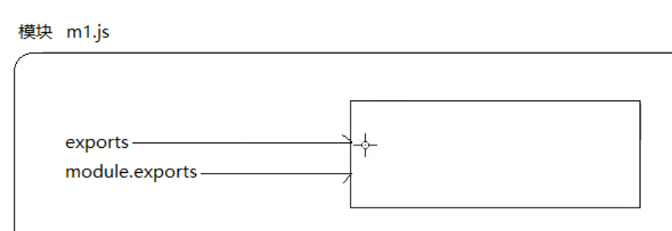
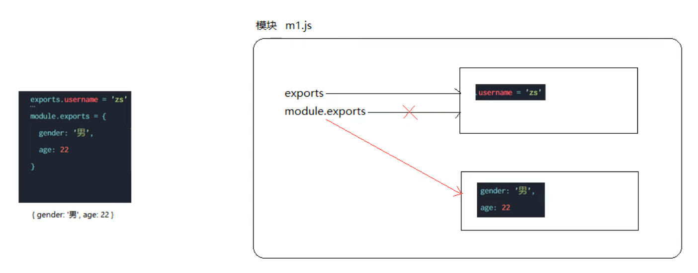
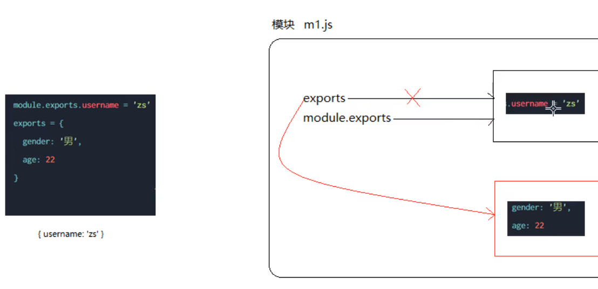
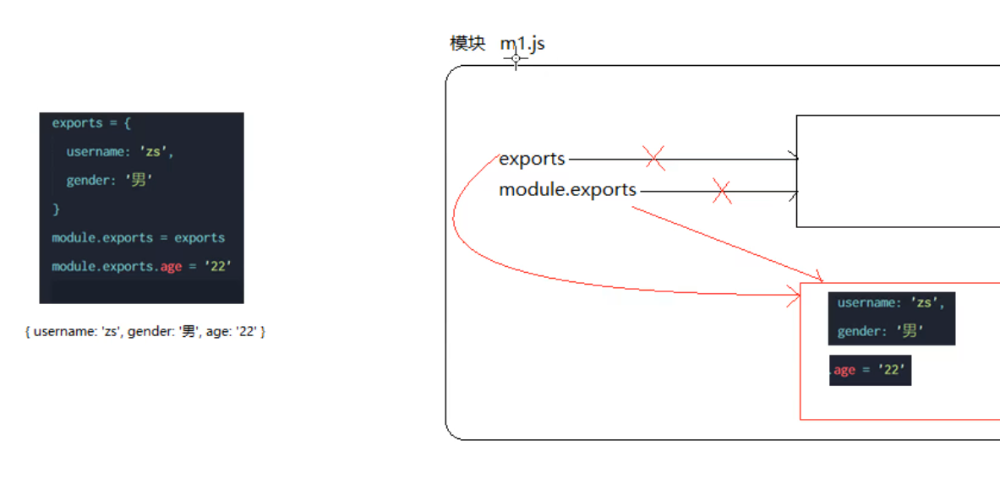

# node

## 从命令行运行 Node.js 脚本

运行 Node.js 程序的常用方法是，运行全局可用的命令 `node`（安装 Node.js 之后）并且传入您要执行的文件的名称。

如果您的 Node.js 主应用程序文件是 `app.js`，则您可以通过键入以下来调用它：

```bash
node app.js
```

以上，你显式地告诉 shell 使用 `node` 运行你的脚本

```bash
#!/usr/bin/node
```

以上，我们显式地给出了解释器的绝对路径。 并非所有操作系统的 bin 文件夹中都有 `node`，但都应该有 `env`。 您可以告诉操作系统使用 node 为参数运行 `env`：

```bash
#!/usr/bin/env node

// 你的代码
```

## fs文件系统模块

fs模块是用来操作文件的模块,它提供了一系列的方法和属性,用来满足对文件的操作需求

```
fs.readFile()方法,用来读取指定文件中的内容
```

```
fs.writeFile()方法,用来向指定的文件中写入内容
```

导入内置模块fs到当前的环境中

```js
const fs = require('fs')
```

## Node中的模块化

### 3大分类

1. 内置模块(官方提供的,例如fs , path , http等)
2. 自定义模块(用户创建的每个.js文件都是自定义模块)
3. 第三方模块(由第三方开发出来的模块)使用前需要先下载

### require方法加载模块

可以加载内置模块,用户自定义模块,第三方模块进行使用,例如:

```js
const { defaultTheme } = require('vuepress')
```

### 模块作用域

和函数作用域类似 在自定义模块中定义的变量,方法等成员,只能在当前模块内被访问,这种模块级别的访问限制,叫做模块作用域

> 防止全局变量污染的问题

### module对象

每个.js文件中都有一个module对象,它里面存储了和当前模块有关的信息,


### module.exports对象

在自定义模块中,可以使用module.exports对象,将模块内的成员共享出去,供外界使用

外界require()方法导入自定义模块时,得到的就是module.exports所指向的对象

### 使用module.exports对象向外共享成员


### exports对象

由于module.exports单词写起来比较长,为了简化共享成员的代码,Node提供了exports对象,默认情况下exports和module.exports指向同一个对象,最终共享的结果 ,还是module.exports指向的对象为准

### exports和module.exports的使用误区

***时刻记住,require() 模块时 ,得到的永远是module.exports指向的对象***










> 为了防止混乱,建议不要在同一个模块中同时使用exports和module.exports

### CommonJS模块化规范

node.js遵循了CommonJS模块化规范 , CommonJS规范了***模块的特性***和各模块之间如何相互依赖

CommonJS规定:

1. 每个模块内部,***module变量***  代表当前模块
2. module变量是一个对象 ,它的exports属性(即module.exports) ***是对外的接口***
3. 加载某个模块,其实是加载该模块的 module.exports 属性 ***require() 方法用于加载模块***

## npm与包

### 什么是包?

node.js中的第三方模块又叫做包

### 包的来源

不同于node.js的内置模块和自定义模块,包是由第三方个人或团队开发出来的,免费供所有人使用

node.js中的包都是免费且开源的,

### 为什么需要包

- 由于node.js的内置模块仅仅提供了一些底层的API,导致在基于内置模块进行项目开发时,效率很低

- ***包是基于内置模块封装出来的***,提供了更高级,更方便的API,极大的提高了开发效率

- *包和内置模块之间的关系,类似于jQuery和浏览器内置API 之间的关系*

那里下载包?

**地址**:[npm](https://www.npmjs.com/)

npm,Inc公司提供了一个地址为https://registry.npmjs.com/的服务器,来对外共享所有的包,我们可以从这个服务器下载自己所需要的包

### 使用第三方的包moment对时间进行格式化

在项目中安装格式化时间的包 moment

moment中文官网http://momentjs.cn/

moment官网https://momentjs.com/

```sh
npm i moment
```

