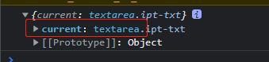
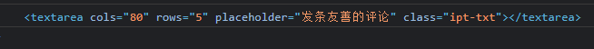

# React

## the-road-to-learn-react

我在[github](https://github.com/TimSpan/the-road-to-learn-react-bookPDF)上传了这本书

## JSX

### JSX到底是什么?

JSX是一种JavaScript的语法扩展，首先在[React](https://baike.baidu.com/item/React/18077599)中被进入，其格式比较像是模版语言，但事实上完全是在[JavaScript](https://baike.baidu.com/item/JavaScript/321142)内部实现的。元素是构成React应用的最小单位，JSX就是用来声明React当中的元素。React主要使用JSX来描述用户界面，但React并不强制要求使用JSX [1] ，而JSX也在React之外的框架得到了广泛的支持，包括Vue.js [3] ，Solid [2] 等。

### 在 JSX 中嵌入表达式

```js
const name = 'Josh Perez';
const element = <h1>Hello, {name}</h1>;
```

在 JSX 语法中，你可以在大括号内放置任何有效的 [JavaScript 表达式](https://developer.mozilla.org/en-US/docs/Web/JavaScript/Guide/Expressions_and_Operators#Expressions)

示例:调用 JavaScript 函数 `formatName(user)` 的结果，并将结果嵌入到 `<h1>` 元素中。

```js
import * as ReactDOM from 'react-dom/client';
const root = ReactDOM.createRoot(document.getElementById('root'));
function formatName(user) {
    return user.firstName + ' ' + user.lastName;
}

const user = {
    firstName: 'Harper',
    lastName: 'Perez'
};

const element = (
    <h1>
        Hello, {formatName(user)}!
    </h1>
);
root.render(element);//Hello, Harper Perez!
```


## 将一个元素渲染为 DOM

### 17version

```js
import React from 'react'
import ReactDOM from 'react-dom'
const title = React.createElement('h1', null, 'hello world')
ReactDOM.render(title, document.getElementById('root'))
```


### 18version

```js
import * as ReactDOM from 'react-dom/client';
const root = ReactDOM.createRoot(document.getElementById('root'));
const element = <h1>Hello world</h1>;
root.render(element);
```

### 深入JSX-语法糖

实际上，JSX 仅仅只是 `React.createElement(component, props, ...children)` 函数的语法糖。比如上面的 JSX 代码：

```js
<h1>Hello world</h1>
//会编译为
React.createElement('h1', null, 'hello world')
```


## 函数组件与 class 组件

### 渲染函数组件(无状态高性能)

定义组件最简单的方式就是编写 JavaScript 函数：

```js
//之前我们遇到的 React 元素都只是 DOM 标签：
const element = <div />;
//不过，React 元素也可以是用户自定义的组件：
const element = <Welcome name="Sara" />;
//当 React 元素为用户自定义组件时，它会将 JSX 所接收的属性（attributes）以及子组件（children）转换为单个对象传递给组件，这个对象被称之为 “props”。

//下面这个函数是一个有效的 React 组件，因为它接收唯一带有数据的 “props”（代表属性）对象与并返回一个 React 元素。
//这类组件被称为“函数组件”，因为它本质上就是 JavaScript 函数。
//函数组件
import * as ReactDOM from 'react-dom/client';
const root = ReactDOM.createRoot(document.getElementById('root'));
function Welcome(props) {
    //函数组件必须有返回值，表示该组件的 UI 结构
    //如果不需要渲染任何内容，则返回 null
    return <h1>Hello, {props.name}</h1>;
    
}
const element = <Welcome name="Sara" />;//渲染组件
root.render(element);//使用组件//Hello, Sara

//当然你可以这样去渲染一个组件
root.render(<Welcome name="Sara" />);
//Hello, Sara//效果是一样的

//组件就像HTML标签一样可以被渲染到页面中。组件表示的是一段结构内容
//对于函数组件来说，函数返回值的内容就是渲染的内容

//也可以使用双标签渲染元素
root.render(<Welcome></Welcome>);
```

让我们来看看这个函数组件渲染是怎么执行的:

1. 我们调用 `root.render()` 函数，并传入 `<Welcome name="Sara" />` 作为参数。
2. React 调用 `Welcome` 组件，并将 `{name: 'Sara'}` 作为 props 传入。
3. `Welcome` 组件将 `<h1>Hello, Sara</h1>` 元素作为返回值。
4. React DOM 将 DOM 高效地更新为 `<h1>Hello, Sara</h1>`。

> ::: tip 组件名称必须以大写字母开头
>
> React 会将以小写字母开头的组件视为原生 DOM 标签。例如，`<div />` 代表 HTML 的 div 标签，而 `<Welcome />` 则代表一个组件，并且需在作用域内使用 `Welcome`。
>
> 1. 函数组件无状态(state),静态,不会发生变化(不考虑hooks的情况下)
> 2. 不能自己提供数据
>
> :::

### 渲染多个组件

```js
import Hello from './hello.js'
import Home from './home.js'
//类组件
// import React from "react";
import { Component } from "react";

import * as ReactDOM from 'react-dom/client';
const root = ReactDOM.createRoot(document.getElementById('root'));
class Welcome extends Component {
    render() {
        return <h1>Hello, {this.props.name}</h1>;
    }
}
root.render(
    <>
        <Welcome name="Sara" />
        <Hello />
        <Home />
    </>
)

//hello.js
const Hello = () => <h1>Hello 你好</h1>
export default Hello
//home.js
const Home = () => <h1>这是首页</h1>
export default Home
```


### class组件(有状态)

```js
//你同时还可以使用 ES6 的 class来定义组件：
import React from "react";
import * as ReactDOM from 'react-dom/client';
const root = ReactDOM.createRoot(document.getElementById('root'));
// 定义ES6 class组件
class Welcome extends React.Component {
    render() {
        return <h1>Hello, {this.props.name}</h1>;
    }
}
root.render(<Welcome name="Sara" />)

1. 类组件应该继承 `React.Component` 父类，从而使用父类中提供的方法或属性
2. 类组件必须提供 render 方法
3. render 方法必须有返回值，表示该组件的 UI 结构
4. 状态（state）是组件的私有数据

//也可以单独引入Component
import {Component} from "react";
class Welcome extends Component {}
```

### class组件的状态state

```js
class Welcome extends Component {
// 为组件提供状态
    state = {
//从语法层面看state就是类的实例属性
        count: 0,
        list: [],
        isLoading: true
    }
    render() {
        console.log(this);// Welcome
        console.log(typeof this); //object
        return (
            // this就是当前类的实例对象
            // 交给了react,react内部回去 new 一下
            <div>计数器：{this.state.count}</div>
        )
    }
}
```


## React核心思想:状态不可变-单向数据流

> ::: tip 注意
>
> ***状态不可变并不是指的状态不能变,而是不要直接修改状态的值，是基于当前状态创建新的状态值***
>
> **状态不可变也可以叫单向数据流**
>
> :::

**不要直接修改 State**.**而是应该使用** `setState()`.**构造函数是唯一可以给 `this.state` 赋值的地方。**

### this.setState修改状态的唯一方式

react唯一修改状态的方式就是`this.setState`

- 思想：**数据驱动视图**，也就是只需要修改数据（状态）那么页面（视图）就会自动刷新
  - 核心：数据！！！
  - 从现在开始，我们关心的是如何修改数据，而不再是关心如何修改DOM
  - 并且，注意：尽量避免直接手动 DOM（通过 document.querySelector() 获取到到DOM对象然后再操作） 操作！！！
- 注意：*不要直接修改 state 中的值，这是无效的*！

### state注意事项

```js
state = {
  count: 0,
  list: [1, 2, 3],
  person: {
    name: 'jack',
    age: 18
  }
}

// 【不推荐】直接修改当前值的操作：
this.state.count++
++this.state.count
this.state.count += 1
this.state.count = 1

// 只要是数组中直接修改当前数组的方法都不能用！
this.state.list.push(123)

this.state.person.name = 'rose'

// 【推荐】不是直接修改当前值，而是创建新值的操作：
this.setState({
  count: this.state.count + 1,
  list: [...this.state.list, 123],
  person: {
    ...this.state.person,
    // 要修改的属性，会覆盖原来的属性，这样，就可以达到修改对象中属性的目的了
    name: 'rose'
  }
})
```


## 事件

JSX中最好不要包含太多的逻辑,可以抽离到单独的函数中

## 受控组件-表单

受控组件：**value值受到了react状态控制的表单元素** 

### onChange

```js
import * as ReactDOM from 'react-dom/client';
import React from 'react';
class App extends React.Component {
    state = {
        msg: 'hello react'
    }

    handleChange = (e) => {
        this.setState({
            msg: e.target.value//最新值
        })
    }

    render() {
        return (
            <div>
                <input
                    type="text"
                    value={this.state.msg}
                    onChange={this.handleChange}//关键
                />
            </div>
        )
    }
}
const root = ReactDOM.createRoot(document.getElementById('root'));
root.render(<App />);
            
//表单value的更新过程:
1. 在文本框输入内容后,会触发文本框的onChange事件
2. onChange事件触发,handleChange中的代码执行
3. handleChange执行后拿到文本框最新的值(e.target.value)
4. 将最新的文本框值交给了setState ,setState更新了状态
5. 调用setState后状态会更新,同时,组件会重新渲染,会重新调用render
6. render重新调用就拿到了文本框最新的值,并且把最新的文本框值渲染到页面上
7. 此时,就看到文本框变化了        
```

### 非受控组件-ref

```js
// 1 导入 createRef 函数（ 用来创建 ref 对象 ）
import { createRef, Component } from 'react'
class Hello extends Component {
//调用 createRef 函数来创建一个 ref 对象
//ref 对象的名称（txtRef）可以是任意值
//命名要规范： txt（DOM 元素的自己标识） + Ref
    txtRef = createRef()
    handleClick = () => {
        // 文本框对应的 DOM 元素
        // console.log(this.txtRef.current)

        // 4 获取文本框的值：
        console.log(this.txtRef.current.value)
    }
    render() {
        return (
            <div>
                <input ref={this.txtRef} />
                <button onClick={this.handleClick}>获取文本框的值</button>
            </div>
        )
        //将创建好的 ref 对象，设置为 input 标签的 ref 属性值
        //作用：将 ref 和 input DOM 绑定到一起，将来在通过 this.txtRef 拿到的就是当前 DOM 对象
    }
}
```

**注意:**

1. ref是个对象,对象中有一个current属性
2. current属性的值才是DOM对象

**打印结果:**

```js
console.log(this.txtRef);
```



```js
console.log(this.txtRef.current);
```



> **尽量避免使用这种方式**

**非受控组件借助ref,使用原生DOM的方式来获取表单元素的值**

- 非受控组件通过React组件的状态来控制表单元素的值
- 手动操作DOM来控制
- ref: 用来在React中获取DOM元素

**何时使用 Refs:**

- 管理焦点，文本选择或媒体播放。
- 触发强制动画。
- 集成第三方 DOM 库。


### 


