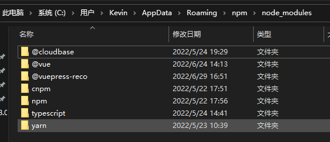

# npm使用手册

[官方文档](https://www.npmjs.com.cn/)

## npm是什么?

包管理工具 npm （node package manager）这个包管理器工具随着Node.js 的安装一起被安装到了用户的电脑上 ,npm由三个独立的部分组成：

- 网站
- 注册表（registry）
- 命令行工具 (CLI)

[*网站*](https://npmjs.com/) 是开发者查找包（package）、设置参数以及管理 npm 使用体验的主要途径。

*注册表* 是一个巨大的数据库，保存了每个包（package）的信息。

[*CLI*](https://docs.npmjs.com/cli/npm) 通过命令行或终端运行。开发者通过 CLI 与 npm 打交道。

## 查看已安装的 npm 软件包

```
npm list
```

`npm list -g` 也一样，但适用于全局安装的软件包。


## 安装npm软件包

有两种方式用来安装 npm 包：**本地安装**和**全局安装**。至于选择哪种方式来安装，取决于我们如何使用这个包。

- 如果你自己的模块依赖于某个包，并通过 Node.js 的 `require` 加载，那么你应该选择本地安装，这种方式也是 `npm install` 命令的默认行为。
- 如果你想将包作为一个命令行工具，（比如 grunt CLI），那么你应该选择[全局安装](https://www.npmjs.cn/getting-started/installing-npm-packages-globally)。

```sh
npm install <package_name>
//  install可以简写成 i 
npm i <package_name>
```

全局安装

```sh
npm install -g <package>
```

## 卸载npm软件包

若要卸载之前在本地安装（在 `node_modules` 文件夹使用 `npm install <package-name>`）的软件包，则从项目的根文件夹（包含 `node_modules` 文件夹的文件夹）中运行：

```bash
npm uninstall <package-name>
npm uninstall jquery
```

如果使用 `-S` 或 `--save` 标志，则还会移除 `package.json` 文件中的引用。

如果程序包是开发依赖项（列出在 `package.json` 文件的 devDependencies 中），则必须使用 `-D` 或 `--save-dev` 标志从文件中移除：

```bash
npm uninstall -S <package-name>
npm uninstall -D <package-name>
```

如果该软件包是全局安装的，则需要添加 `-g` 或 `--global` 标志：

```bash
npm uninstall -g <package-name>
```

## npm全局和本地

本地和全局的软件包之间的主要区别是：

- **本地的软件包** 安装在运行 `npm install <package-name>` 的目录中，并且放置在此目录下的 `node_modules` 文件夹中。
- **全局的软件包** 放在系统中的单独位置（确切的位置取决于设置），无论在何处运行 `npm install -g <package-name>`。

在代码中，应该只引入本地的软件包：

```js
JS
require('package-name')
```

所以何时应该以一种或另一种方式安装？

通常，所有的软件包都应本地安装。

这样可以确保计算机中可以有数十个应用程序，并且如果需要，每个应用程序都可以运行不同的版本。

***更新全局软件包会使所有的项目都使用新的版本，这可能会导致维护方面的噩梦，因为某些软件包可能会破坏与其他依赖项的兼容性等。***

所有的项目都有自己的软件包本地版本，即使这看起来有点浪费资源，但与可能产生的负面影响相比也很小。

当程序包提供了可从 shell（CLI）运行的可执行命令、且可在项目间复用时，则该程序包应被全局安装。

也可以在本地安装可执行命令并使用 npx 运行，但是某些软件包最好在全局安装。

一些流行的全局软件包的示例有：

- `npm`
- `create-react-app`
- `vue-cli`
- `grunt-cli`
- `mocha`
- `react-native-cli`
- `gatsby-cli`
- `forever`
- `nodemon`

可能已经在系统上安装了一些全局软件包。 可以通过在命令行上运行以下命令查看：

```bash
BASH
npm list -g --depth 0
```


## npm语义版本控制

如果 Node.js 软件包中有一件很棒的事情，那就是它们都同意使用语义版本控制作为版本编号。

语义版本控制的概念很简单：所有的版本都有 3 个数字：`x.y.z`。

- 第一个数字是主版本。也可以叫**大版本**
- 第二个数字是次版本。也可以叫**功能版本**
- 第三个数字是补丁版本。也可以叫**Bug修复版本**

当发布新的版本时，不仅仅是随心所欲地增加数字，还要遵循以下规则：

- 当进行不兼容的 API 更改时，则升级主版本。
- 当以向后兼容的方式添加功能时，则升级次版本。
- 当进行向后兼容的缺陷修复时，则升级补丁版本。

该约定在所有编程语言中均被采用，每个 `npm` 软件包都必须遵守该约定，这一点非常重要，因为整个系统都依赖于此。

为什么这么重要？

因为 `npm` 设置了一些规则，可用于在 `package.json` 文件中选择要将软件包更新到的版本（当运行 `npm update` 时）。

规则使用了这些符号：

- `^`
- `~`
- `>`
- `>=`
- `<`
- `<=`
- `=`
- `-`
- `||`

这些规则的详情如下：

- `^`: 只会执行不更改最左边非零数字的更新。 如果写入的是 `^0.13.0`，则当运行 `npm update` 时，可以更新到 `0.13.1`、`0.13.2` 等，但不能更新到 `0.14.0` 或更高版本。 如果写入的是 `^1.13.0`，则当运行 `npm update` 时，可以更新到 `1.13.1`、`1.14.0` 等，但不能更新到 `2.0.0` 或更高版本。
- `~`: 如果写入的是 `〜0.13.0`，则当运行 `npm update` 时，会更新到补丁版本：即 `0.13.1` 可以，但 `0.14.0` 不可以。
- `>`: 接受高于指定版本的任何版本。
- `>=`: 接受等于或高于指定版本的任何版本。
- `<=`: 接受等于或低于指定版本的任何版本。
- `<`: 接受低于指定版本的任何版本。
- `=`: 接受确切的版本。
- `-`: 接受一定范围的版本。例如：`2.1.0 - 2.6.2`。
- `||`: 组合集合。例如 `< 2.1 || > 2.6`。

可以合并其中的一些符号，例如 `1.0.0 || >=1.1.0 <1.2.0`，即使用 1.0.0 或从 1.1.0 开始但低于 1.2.0 的版本。

```json
  "dependencies": {
    "vue": "^3.2.25"
  },
  "devDependencies": {
    "@vitejs/plugin-vue": "^2.3.3",
    "vite": "^2.9.9"
  }
```

## node_modules文件夹

node_modules 文件夹用来`存放所有已安装到项目中的包`。require() 导入第三方包时，就是从这个目录中查找并加载包。

## package-lock.json

***package-lock.json 配置文件用来记录 node_modules 目录下的每一个包的下载信息，例如包的名字、版本号、下载地址等。***

`package-lock.json`对于 npm 修改`node_modules`树或`package.json`. 它描述了生成的确切树，以便后续安装能够生成相同的树，而不管中间依赖项更新如何。

- 描述依赖关系树的单一表示，以保证团队成员、部署和持续集成安装完全相同的依赖关系。
- 为用户提供一种“时间旅行”到以前状态的工具，`node_modules`而无需提交目录本身。
- 通过可读的源代码控制差异来促进对树更改的更大可见性。
- 并通过允许 npm 跳过以前安装的包的重复元数据解析来优化安装过程。

## 安装指定版本的npm包

通过@符号指定安装包时的版本号

- @

```sh
npm i moment@2.22.2
```

## 使用package.json

- `version` 表明了当前的版本。
- `name` 设置了应用程序/软件包的名称。
- `description` 是应用程序/软件包的简短描述。
- `main` 设置了应用程序的入口点。
- `private` 如果设置为 `true`，则可以防止应用程序/软件包被意外地发布到 `npm`。
- `scripts` 定义了一组可以运行的 node 脚本。
- `dependencies` 设置了作为依赖安装的 `npm` 软件包的列表。
- `devDependencies` 设置了作为开发依赖安装的 `npm` 软件包的列表。
- `engines` 设置了此软件包/应用程序在哪个版本的 Node.js 上运行。
- `browserslist` 用于告知要支持哪些浏览器（及其版本）。

### `--save`安装`--save-dev`标志

添加依赖项的更简单（也更棒）的方法是从命令行执行此操作，使用或 `package.json`标记`npm install`命令，具体取决于您希望如何使用该依赖项。`--save  --save-dev`

在`package.json`'s 下的dependencies 下添加入口

To add an entry to your `package.json`'s `dependencies`:

```sh
npm install <package_name> --save
```

To add an entry to your `package.json`'s `devDependencies`:

```sh
npm install <package_name> --save-dev
```

## 进一步了解package.json

### 多人协作的问题:

package.json中必须包含name,version,main这三个属性,分别代表包的名字,版本号,包的入口

```json
  "name": "kblog",
  "version": "1.0.0",
  "description": "",
  "main": "index.js",
```

第三方包的体积过大,不方便在团队成员之间共享项目源代码

***解决:把node_modules添加到.gitignore忽略文件中***

***package.json中会记录之前安装过哪些包***，团队成员拉取代码后直接基于package.json就可以快速把需要的第三方包都安装好（只需要执行一条命令）

### 通过命令快速创建package.json文件

```sh
npm init -y
```

> 项目文件夹的名称一定要使用英文命名，不能出现空格

> 运行 npm install 命令安装包的时候,npm包概念里工具会自动把包的名称和版本号,记录到package.json中

### dependencies节点

专门用来记录您使用 npm install 命令安装了哪些包。

## devDependencies节点

- 如果某些包只在项目***开发阶段***会用到，在项目上线之后不会用到，则建议把这些包记录到 ***devDependencies*** 节点中。
- 与之对应的，如果某些包在开发和项目上线之后都需要用到，则建议把这些包记录到 dependencies 节点中

### 开发依赖包

To add an entry to your `package.json`'s `devDependencies`:

```sh
npm install <package_name> --save-dev
```

```sh
// 指定为开发依赖包，而非核心依赖包
npm i 包名 -D
或者
npm install 包名 --save-dev
```


### 安装多个包

一次安装多个包,分别是jquery 和 art-template,中间用空格隔开

```sh
npm i jquery art-template
```

### 一次性安装所有的包

```sh
npm install
或者
npm i
```

> 执行npm install 命令时，npm包管理工具会先读取 packagejson 中的dependencies节点 
>
>  读取到记录的所有依赖包名称和版本号之后，npm 包管理工具会把这些包一次性下载到项目中中

## npm包分类

### 开发依赖包

开发依赖包（被记录到 devDependencies 节点中的包，只在开发期间会用到）

### 核心依赖包

核心依赖包（被记录到 dependencies 节点中的包，在开发期间和项目上线之后都会用到）

### 全局包目录地址

在执行npm install命令时 , 如果提供了-g参数 ,则会把包安装为全局包

全局包会被安装到C:\Users\Kevin\AppData\Roaming\npm\node_modules目录下



> 只有**工具性的包** ,才会有全局安装的必要性,因为它们提供了好用的终端命令

### i5ting_toc将md转为html

i5ting_toc是一个可以把md文档转为html页面的小工具

## 开发属于自己的包

### 了解需要实现的功能


### 初始化包的基本解构

新建 `project_name-tools` 文件夹，作为包的根目录

在 `project_name-tools` 文件夹中，新建如下三个文件：

- `package.json` (包管理配置文件)
- `index.js` (包的入口文件) ***通过require导入这个文件***
- `README.md` (包的说明文档)

### 初始化package.json配置文件

```js
{
  "name": "project_name-tools",//名字不能是npm已经有的
  "version": "1.1.0",//版本
  "main": "index.js",//入口文件
  "description": "提供了XXX功能",
  "keywords": [//搜索关键字
    "XXX",
    "XXX",
    "XXX"
  ],
  "license": "ISC"
}
```


### 在index.js中定义格式化时间的方法


### package.json中main属性

package.json中main属性的作用:

1. `Node` 在使用 `require` 导入某个路径的时候，发现没有具体的文件，就会看这个路径下查看是否有 `package.json` 这个文件
2. 如果有，则查看是否有 `main` 这个属性
3. 而如果main属性也有，则指定 `main` 属性对应的文件作为要执行的文件

### 将不同的功能进行模块化的拆分

index.js中不写太多代码，主要负责导入其他模块，并把这些模块中需要向外暴露的成员，统一往外暴露。

## 把包发布到npm上

将终端切换到包的根目录之后 .运行 `npm publish` 命令，即可将包发布到 `npm` 上

> 注意:包名不能雷同

### 删除已发布的包

`npm unpublish 包名 --force`

> - `npm unpublish` 命令只能删除 72 小时以内发布的包
> - `npm unpublish` 删除的包，**在 24 小时内不允许重复发布**