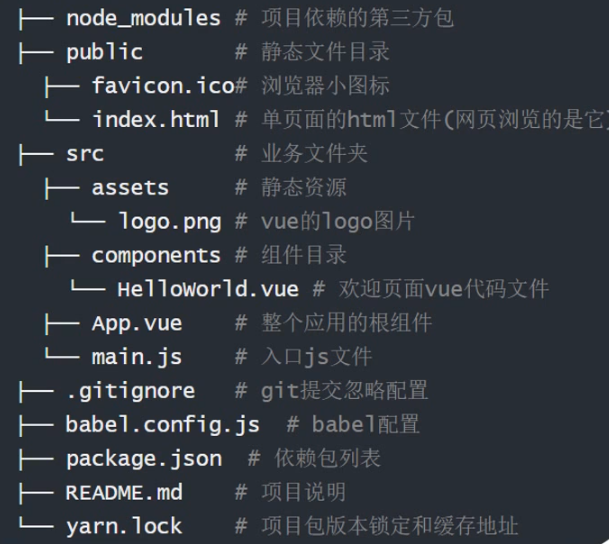
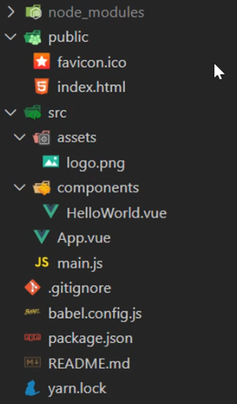
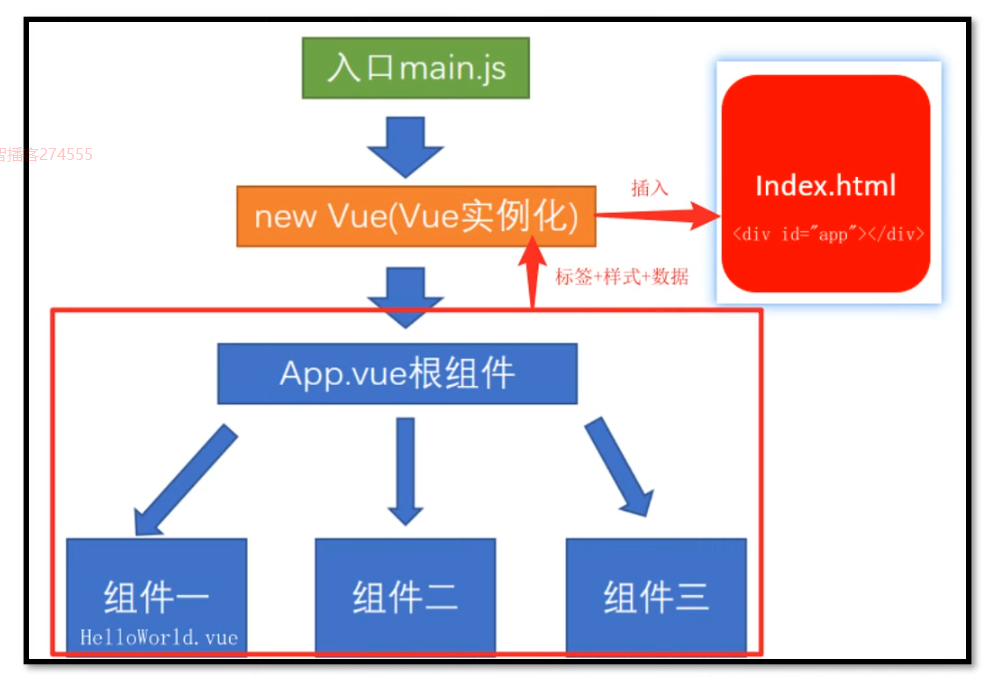

# vue.js

## 通过脚手架CLI创建应用

[官方文档](https://cli.vuejs.org/zh/)

起步

安装

```sh
npm install -g @vue/cli
# OR
yarn global add @vue/cli
```

创建一个项目

```sh
vue create my-project
# OR
vue ui
```

启动

根据`package.json`文件中的配置来输入命令启动项目

```sh
cd my-project
npm run serve
```

## 目录

**public/index.html 是单页面的html文件 (网页浏览的就是它)**

**App.vue整个应用的根组件**(vue页面入口)

**mian.js入口js文件**(webpack打包的入口)







### 自定义配置

项目中没有webpack.config.js文件,因为vue脚手架项目用的`vue.config.js` 二次封装

### eslint检查代码

如果代码违反了eslint的规则 -报错 

## 注册组件

创建组件.vue文件,封装要复用的标签,样式,JS代码

### 全局注册

**全局注册-mian.js中**

**组件名当html标签使用**

### 2.x 语法

在 2.x 中，注册一个组件后，把组件名作为字符串传递给渲染函数的第一个参数，它可以正常地工作：

```js
// 2.x
Vue.component('button-counter', {
  data() {
    return {
      count: 0
    }
  },
  template: `
    <button @click="count++">
      Clicked {{ count }} times.
    </button>
  `
})

export default {
  render(h) {
    return h('button-counter')
  }
}
```

### 3.x 语法

在 3.x 中，由于 VNode 是上下文无关的，不能再用字符串 ID 隐式查找已注册组件。取而代之的是，需要使用一个导入的 `resolveComponent` 方法：

```js
// 3.x
import { h, resolveComponent } from 'vue'

export default {
  setup() {
    const ButtonCounter = resolveComponent('button-counter')
    return () => h(ButtonCounter)
  }
}
```

### 局部注册

通过 Babel 和 webpack 使用 ES2015 (ES6)模块

```js
import TopNav from './components/TopNav.vue' 
import SwiperTop from './components/SwiperTop.vue' 
export default {
  components: {//局部注册组件
    TopNav,
    SwiperTop,
    ComponentA
  }
}
```

注意在 ES2015+ 中，在对象中放一个类似 `ComponentA` 的变量名其实是 `ComponentA: ComponentA` 的缩写，即这个变量名同时是：

- 用在模板中的自定义元素(单标签)的名称
- 包含了这个组件选项的变量名

### 在模块系统中局部注册

如果你还在阅读，说明你使用了诸如 Babel 和 webpack 的模块系统。在这些情况下，我们推荐创建一个 `components` 目录，并将每个组件放置在其各自的文件中。

然后你需要在局部注册之前导入每个你想使用的组件。例如，假设在 `App.vue` 文件中：

```vue
<template>
  <TopNav/>
  <SwiperTop/>
</template>

<script>
import TopNav from './components/TopNav.vue' 
import SwiperTop from './components/SwiperTop.vue' 
export default {
  components: {//局部注册组件
    TopNav,
    SwiperTop
  }
}
</script>
```

现在 TopNav 和 SwiperTop 都可以在 App.vue 的模板中使用了。

## 生命周期钩子函数

作用:特定的时间,执行特定的操作

场景:组件创建完毕后,可以在created生命周期函数中发起Ajax请求,从而初始化data数据


|  阶段  |    方法名     |  方法名   |
| :----: | :-----------: | :-------: |
| 初始化 | beforeCreate  |  created  |
|  挂载  |  beforeMount  |  mounted  |
|  更新  | beforeUpdate  |  updated  |
|  销毁  | beforeDestroy | destroyed |


